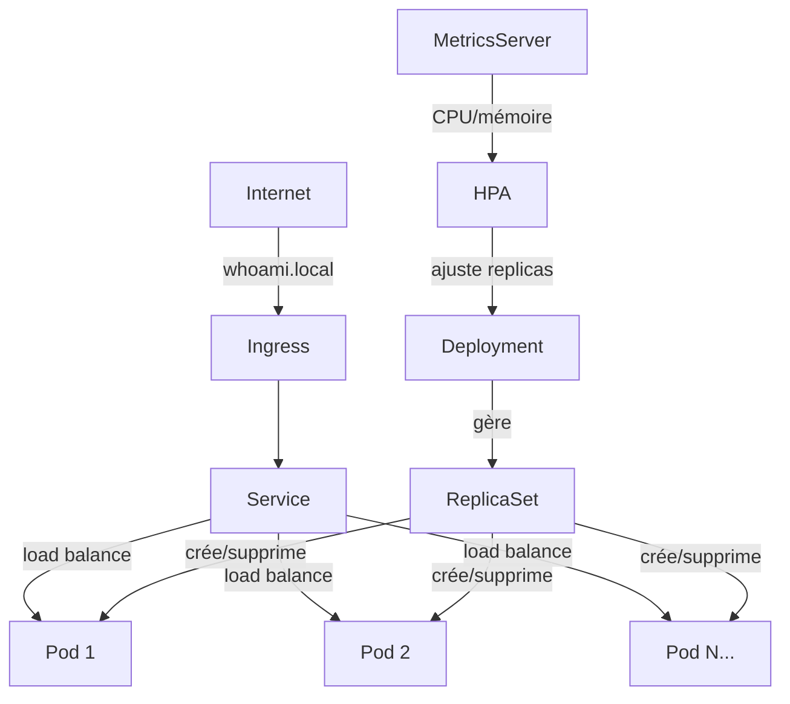

# Introduction à Kubernetes — Déploiement, Ingress et Autoscaling

Objectif: construire progressivement un projet kube pour déployer un conteneur, en y ajoutant un **Deployment**, une règle **Ingress par hostname**, et un **HPA** (Horizontal Pod Autoscaler).

> **Prérequis :** minikube démarré avec le plugin ingress activé.
> ```bash
> minikube start
> minikube addons enable ingress
> ```

Nous travaillerons dans un dossier projet nommé "1.whoami"

---

## Les fichiers de la démo `1.whoami`

La démo est composée de **4 fichiers manifests** séparés. En Kubernetes, un manifest est un fichier YAML qui décrit l'état désiré d'une ressource. Kubernetes compare en permanence cet état désiré avec l'état réel du cluster — c'est le principe de la **réconciliation**.

> **Un fichier par ressource vs tout dans un seul fichier :** on a séparé chaque ressource dans son propre fichier pour plus de clarté pédagogique. En pratique, plusieurs ressources peuvent être regroupées dans un seul fichier en les séparant par `---`. Les deux approches sont valides.

### `whoami.ns.yaml` — Namespace

```yaml
apiVersion: v1
kind: Namespace
metadata:
  name: whoami
```

Un **Namespace** est un espace de nommage qui isole logiquement des groupes de ressources dans le cluster. Il permet de séparer des projets, des équipes ou des environnements (staging/prod) sur le même cluster.

> Sans namespace explicite, les ressources sont créées dans `default`. Bonne pratique : toujours nommer ses namespaces.

---

### `whoami.pod.yaml` — Pod

```yaml
apiVersion: v1
kind: Pod
metadata:
  name: whoami
  namespace: whoami
  labels:
    app.kubernetes.io/name: whoami
spec:
  containers:
  - name: whoami
    image: traefik/whoami
    resources:
      limits:
        memory: "128Mi"
        cpu: "500m"
      requests:
        memory: "64Mi"
        cpu: "250m"
    ports:
      - containerPort: 80
```

Un **Pod** est l'unité de base de Kubernetes : il encapsule un ou plusieurs conteneurs qui partagent le même réseau et le même stockage. C'est ici qu'on déclare l'image à utiliser, les ports exposés, et les ressources allouées.

| Champ | Signification |
|---|---|
| `resources.requests` | Ressources **garanties** — Kubernetes reserve cet espace sur un nœud |
| `resources.limits` | Ressources **maximales** — le conteneur ne peut pas dépasser cette limite |
| `labels` | Tags clé/valeur utilisés pour sélectionner les pods (par le Service, le Deployment...) |

> **Important :** un Pod seul n'est pas résilient. S'il crashe, Kubernetes ne le redémarre pas automatiquement. C'est pour ça qu'en production on n'utilise jamais de Pod directement — on utilise un **Deployment** (voir plus bas).

---

### `whoami.svc.yaml` — Service

```yaml
apiVersion: v1
kind: Service
metadata:
  name: whoami
  namespace: whoami
spec:
  selector:
    app.kubernetes.io/name: whoami
  ports:
  - port: 80
    targetPort: 80
  type: ClusterIP
```

Un **Service** expose un groupe de Pods sous une adresse IP stable et un nom DNS interne. Il fait office de **load balancer interne** : si plusieurs Pods correspondent au `selector`, le Service distribue le trafic entre eux.

| Type | Accessible depuis | Usage |
|---|---|---|
| `ClusterIP` | À l'intérieur du cluster uniquement | Communication inter-services |
| `NodePort` | Depuis l'extérieur via un port du nœud | Dev/test, pas recommandé en prod |
| `LoadBalancer` | Via un load balancer cloud (AWS ELB...) | Production sur cloud |

> Le `selector` doit correspondre exactement aux `labels` des Pods ciblés.

---

### `whoami.ingress.yml` — Ingress (path prefix)

```yaml
apiVersion: networking.k8s.io/v1
kind: Ingress
metadata:
  namespace: whoami
  name: whoami-ingress
  labels:
    app.kubernetes.io/name: whoami-ingress
spec:
  rules:
  - http:
      paths:
      - pathType: Prefix
        path: "/whoami"
        backend:
          service:
            name: whoami
            port:
              number: 80
```

Un **Ingress** est un routeur HTTP/HTTPS qui expose des services à l'extérieur du cluster. Il permet de définir des règles de routage basées sur le **chemin** (`/whoami`) ou le **hostname** (`whoami.local`).

> L'Ingress a besoin d'un **Ingress Controller** pour fonctionner — c'est lui qui implémente les règles. Sur minikube, on utilise le controller nginx intégré (activé via `minikube addons enable ingress`).

---

## Etape 0 — Créer le projet

Créer un nouveau projet 

Créer un dossier de travail pour notre parcours (ex `k8s/`) et y copier les 4 fichiers de la démo :

```bash
cd <mon repertoire de travail>
mkdir k8s
```

Structure du projet :

```
k8s/
└── 1.whoami/
    ├── whoami.ns.yaml
    ├── whoami.pod.yaml
    ├── whoami.svc.yaml
    └── whoami.ingress.yml
```

---

## Etape 1 — Vérifier la configuration initiale (path prefix)

Appliquer tous les manifests :

```bash
kubectl apply -f 1.whoami/
```
ou
```bash
cd 1.whoami
kubectl apply -f .
```

Vérifier que le Pod tourne :

```bash
kubectl get pods -n whoami
# NAME     READY   STATUS    RESTARTS   AGE
# whoami   1/1     Running   0          30s
```

### Tester l'accès via path prefix

Sur minikube, l'Ingress n'est pas accessible directement depuis `localhost`. Deux options :

**Option A — `minikube tunnel`** (recommandé) :

Dans un terminal dédié (laisser tourner) :
```bash
minikube tunnel
```
Puis tester :
```bash
curl http://localhost/whoami
```

**Option B — IP de minikube** :
```bash
MINIKUBE_IP=$(minikube ip)
curl http://$MINIKUBE_IP/whoami
```

On doit voir la réponse caractéristique de `traefik/whoami` :
```
Hostname: whoami
IP: 10.244.0.x
RemoteAddr: ...
GET /whoami HTTP/1.1
...
```

---

## Etape 2 — Passer à un Ingress par hostname

En production, on route rarement par préfixe de chemin — on utilise des **hostnames** dédiés par application (`whoami.mondomaine.com`). C'est plus propre, plus flexible, et correspond aux pratiques réelles.

### Modifier `1.whoami/whoami.ingress.yml`

Remplacer la règle path prefix par une règle hostname :

```yaml
apiVersion: networking.k8s.io/v1
kind: Ingress
metadata:
  namespace: whoami
  name: whoami-ingress
  labels:
    app.kubernetes.io/name: whoami-ingress
spec:
  rules:
  - host: whoami.local          # ← hostname au lieu du path
    http:
      paths:
      - pathType: Prefix
        path: "/"               # ← toutes les requêtes vers ce host
        backend:
          service:
            name: whoami
            port:
              number: 80
```

Appliquer :

```bash
kubectl apply -f 1.whoami/whoami.ingress.yml
```

### Résoudre `whoami.local` en local

Le hostname `whoami.local` n'existe pas dans le DNS. Il faut l'ajouter manuellement dans `/etc/hosts` (macOS/Linux) ou `C:\Windows\System32\drivers\etc\hosts` (Windows) :

```bash
# Récupérer l'IP minikube (ou 127.0.0.1 si minikube tunnel actif)
echo "$(minikube ip)  whoami.local" | sudo tee -a /etc/hosts
# ou avec tunnel :
echo "127.0.0.1  whoami.local" | sudo tee -a /etc/hosts
```

Tester :

```bash
curl http://whoami.local
# ou ouvrir http://whoami.local dans un navigateur
```

> **Pourquoi `whoami.local` et pas `whoami.com` ?** Le suffixe `.local` est une convention pour les domaines de développement local. N'utiliser jamais un vrai domaine dans `/etc/hosts` — ça intercepterait le trafic réel.

---

## Etape 3 — Passer du Pod au Deployment

### Pourquoi un Deployment ?

Jusqu'ici on a un **Pod nu** — une seule instance, non résiliente :

| Situation | Pod seul | Deployment |
|---|---|---|
| Pod crashe | ❌ Kubernetes ne le redémarre pas | ✅ Kubernetes recrée automatiquement |
| Mise à jour de l'image | ❌ Supprimer/recréer manuellement | ✅ Rolling update automatique |
| Scaling (N instances) | ❌ Impossible directement | ✅ `replicas: 3` |
| Rollback | ❌ Manuel | ✅ `kubectl rollout undo` |

### Le Deployment et le ReplicaSet

Un Deployment ne gère pas directement les Pods — il crée et gère un **ReplicaSet**, qui lui gère les Pods. Cette hiérarchie existe pour permettre les rollbacks :

```
Deployment  →  ReplicaSet v2 (actuel, 3 pods)
            →  ReplicaSet v1 (ancien, 0 pods — conservé pour rollback)
```

Quand on met à jour l'image d'un Deployment, Kubernetes crée un nouveau ReplicaSet (v2) et réduit progressivement l'ancien (v1) — c'est le **rolling update**.

> **Ne jamais gérer un ReplicaSet directement** — laisser le Deployment le faire. Le ReplicaSet est une ressource de bas niveau que Kubernetes gère pour nous.

### Supprimer le Pod et créer le Deployment

```bash
# Supprimer le pod existant
kubectl delete -f 1.whoami/whoami.pod.yaml
```

Créer `1.whoami/whoami.deployment.yaml` en vous appuyant sur le squelette fourni ([assets/attachments/1.whoami/whoami.deployment.yaml](assets/attachments/k8s/whoami.deployment.yaml)) et la [documentation officielle](https://kubernetes.io/docs/concepts/workloads/controllers/deployment/) :

```yaml
apiVersion: apps/v1
kind: Deployment
metadata:
  name: whoami
  namespace: whoami
  labels:
    app.kubernetes.io/name: whoami
spec:
  replicas: 2                    # nombre d'instances souhaitées
  selector:
    matchLabels:
      app.kubernetes.io/name: whoami   # sélectionne les pods à gérer
  template:                      # modèle de Pod que le Deployment va créer
    metadata:
      labels:
        app.kubernetes.io/name: whoami
    spec:
      containers:
      - name: whoami
        image: traefik/whoami
        resources:
          limits:
            memory: "128Mi"
            cpu: "500m"
          requests:
            memory: "64Mi"
            cpu: "250m"
        ports:
          - containerPort: 80
```

Appliquer :

```bash
kubectl apply -f 1.whoami/whoami.deployment.yaml
kubectl get pods -n whoami
# NAME                      READY   STATUS    RESTARTS   AGE
# whoami-7d9f5b8c4-xk2p9   1/1     Running   0          15s
# whoami-7d9f5b8c4-mn4r7   1/1     Running   0          15s
```

Tester `http://whoami.local` plusieurs fois — la réponse montre un `Hostname` différent à chaque requête : le Service distribue le trafic entre les 2 Pods.

---

## Etape 4 — Stratégies de déploiement

Kubernetes propose des stratégies de mise à jour natives. Voici les plus courantes dans l'écosystème :


### Stratégies natives Kubernetes

| Stratégie | Principe | Kubernetes natif |
|---|---|---|
| **Recreate** | Arrêter tout, puis redéployer | ✅ (`strategy: Recreate`) |
| **Rolling Update** | Remplacer les pods progressivement | ✅ (défaut) |
| **Blue/Green** | Deux environnements en parallèle, bascule instantanée | ⚠️ Simulable avec deux Deployments + Service swap |
| **Canary** | Envoyer un % du trafic vers la nouvelle version | ⚠️ Simulable avec les replicas et pondération Ingress |

> **Blue/Green et Canary** ne sont pas des stratégies natives de Kubernetes au sens strict — elles nécessitent soit une configuration manuelle, soit des outils dédiés comme **ArgoCD** ou **FluxCD** (GitOps) qui apportent ces fonctionnalités nativement.

### Rolling Update — la stratégie par défaut


Par défaut, un Deployment utilise une stratégie **RollingUpdate** : les anciens Pods sont remplacés progressivement par les nouveaux, en maintenant une disponibilité minimale tout au long du processus.

Deux paramètres contrôlent ce comportement :

```yaml
spec:
  strategy:
    type: RollingUpdate
    rollingUpdate:
      maxUnavailable: 1    # nombre max de pods indisponibles pendant la mise à jour
      maxSurge: 1          # nombre max de pods supplémentaires créés pendant la mise à jour
```

> **Ressource complète :** [bluematador.com — Kubernetes Deployments: Rolling Update Configuration](https://www.bluematador.com/blog/kubernetes-deployments-rolling-update-configuration)

### Les rollouts : la brique fondamentale

Tout ce qu'on appelle "stratégie de déploiement" repose en réalité sur la mécanique des **rollouts** de Kubernetes. Un rollout, c'est la transition contrôlée d'un état vers un autre — Kubernetes garde un historique de ces transitions et peut revenir en arrière à tout moment.

> **C'est aussi sur cette mécanique que s'appuient les outils GitOps comme ArgoCD et FluxCD** pour implémenter des stratégies plus avancées (Blue/Green, Canary...) : ils manipulent les Deployments et pilotent les rollouts via l'API Kubernetes, sans rien inventer en dehors de ce que Kubernetes propose nativement.

### Jouer un Rolling Update

**Terminal 1 — Observer en continu :**

```bash
# Option A : boucle de requêtes HTTP (voir les Hostnames changer)
while true; do curl -s http://whoami.local | grep Hostname; sleep 0.5; done

# Option B : observer l'état des pods en temps réel
watch kubectl get pods -n whoami
```

**Option C — Minikube Dashboard :**

```bash
minikube dashboard
```

Ouvre une interface web dans le navigateur. Dans **Workloads > Deployments > whoami**, on peut observer visuellement les Pods se créer et se terminer pendant le rolling update.

**Terminal 2 — Déclencher la mise à jour :**

```bash
# Changer l'image (simule une nouvelle version de l'application)
kubectl set image deployment/whoami whoami=traefik/whoami:v1.5.0 -n whoami
```

Observer que les requêtes continuent de répondre sans interruption pendant toute la durée du rolling update.

**Commandes rollout à explorer :**

```bash
# Suivre la progression du rollout en cours
kubectl rollout status deployment/whoami -n whoami

# Afficher l'historique des révisions du Deployment
kubectl rollout history deployment/whoami -n whoami

# Détail d'une révision spécifique
kubectl rollout history deployment/whoami -n whoami --revision=2

# Revenir à la révision précédente (rollback)
kubectl rollout undo deployment/whoami -n whoami

# Revenir à une révision précise
kubectl rollout undo deployment/whoami -n whoami --to-revision=1

# Mettre en pause un rollout en cours (pour inspecter avant de continuer)
kubectl rollout pause deployment/whoami -n whoami
kubectl rollout resume deployment/whoami -n whoami
```

> **`rollout history`** ne conserve les révisions que si `--record` a été utilisé (déprécié) ou si les annotations `kubernetes.io/change-cause` sont renseignées dans le manifest. Sans ça, les révisions existent mais sans description textuelle. Bonne pratique : annoter ses changements.

---

## Etape 5 — Horizontal Pod Autoscaler (HPA)

### Qu'est-ce que l'HPA ?

Un **Horizontal Pod Autoscaler** surveille les métriques d'un Deployment (CPU, mémoire, métriques custom) et **ajuste automatiquement le nombre de réplicas** en fonction de la charge.

```
charge ↑  →  HPA augmente replicas  →  plus de Pods  →  charge distribuée
charge ↓  →  HPA réduit replicas    →  moins de Pods →  coûts réduits
```

> L'HPA travaille horizontalement (plus de Pods) par opposition au VPA (Vertical Pod Autoscaler) qui travaille verticalement (plus de CPU/RAM par Pod).

**Référence officielle :** [kubernetes.io — Horizontal Pod Autoscaling](https://kubernetes.io/docs/concepts/workloads/autoscaling/horizontal-pod-autoscale/)

### Prérequis : Metrics Server

L'HPA a besoin du **Metrics Server** pour lire les métriques CPU/mémoire des Pods. Sur minikube :

```bash
minikube addons enable metrics-server

# Vérifier qu'il tourne (peut prendre 1-2 minutes)
kubectl top pods -n whoami
```

### À vous de jouer — Créer le fichier HPA

En vous appuyant sur la [documentation officielle](https://kubernetes.io/docs/concepts/workloads/autoscaling/horizontal-pod-autoscale/) et le squelette ci-dessous, créer le fichier `1.whoami/whoami.hpa.yaml` :

```yaml
apiVersion: ____________
kind: HorizontalPodAutoscaler
metadata:
  name: whoami-hpa
  namespace: ____________
spec:
  scaleTargetRef:
    apiVersion: ____________
    kind: ____________
    name: ____________          # nom du Deployment à scaler
  minReplicas: ____________     # minimum de pods (même si charge = 0)
  maxReplicas: ____________     # maximum de pods (même si charge très haute)
  metrics:
  - type: Resource
    resource:
      name: ____________        # métrique surveillée (cpu ou memory)
      target:
        type: ____________      # type de seuil
        ____________: ____________   # valeur du seuil (ex: 50%)
```

> **Indices :**
> - `apiVersion` de l'HPA : chercher dans la doc quelle version est stable en Kubernetes 1.23+
> - `scaleTargetRef.apiVersion` : c'est la même que celle du Deployment
> - `type: Utilization` avec `averageUtilization: 50` signifie "scaler quand la CPU moyenne dépasse 50% des `requests`"
> - Les `resources.requests` doivent être définis dans le Deployment pour que l'HPA puisse calculer un pourcentage

Une fois le fichier créé :

```bash
kubectl apply -f 1.whoami/whoami.hpa.yaml

# Vérifier l'état de l'HPA
kubectl get hpa -n whoami
# NAME         REFERENCE           TARGETS   MINPODS   MAXPODS   REPLICAS
# whoami-hpa   Deployment/whoami   5%/50%    1         5         2
```

### Bonus — Simuler une charge pour déclencher le scaling

Dans un terminal, générer de la charge sur l'application :

```bash
# Lancer un pod de charge temporaire
kubectl run load-generator \
  --image=busybox \
  --restart=Never \
  -n whoami \
  -- /bin/sh -c "while true; do wget -q -O- http://whoami.whoami.svc.cluster.local; done"
```

Dans un autre terminal, observer le scaling en temps réel :

```bash
kubectl get hpa whoami-hpa -n whoami -w
```

Après quelques minutes, le nombre de réplicas doit augmenter automatiquement. Supprimer le pod de charge et observer la réduction progressive :

```bash
kubectl delete pod load-generator -n whoami
```

---

## Recap — Structure finale du projet

```
1.whoami/
├── whoami.ns.yaml            ← Namespace (isolement)
├── whoami.deployment.yaml    ← Deployment (résilience, rolling update)
├── whoami.svc.yaml           ← Service (load balancing interne)
├── whoami.ingress.yml        ← Ingress (routage par hostname)
└── whoami.hpa.yaml           ← HPA (autoscaling)
```



### Commandes utiles recap

```bash
# Appliquer tous les manifests
kubectl apply -f 1.whoami/

# État des ressources dans le namespace
kubectl get all -n whoami

# Détail d'une ressource (très utile pour déboguer)
kubectl describe pod <nom-pod> -n whoami
kubectl describe hpa whoami-hpa -n whoami

# Logs d'un pod
kubectl logs <nom-pod> -n whoami

# Rollback d'un deployment
kubectl rollout undo deployment/whoami -n whoami

# Supprimer tout
kubectl delete -f 1.whoami/
```

---

## Pour aller plus loin

| Sujet | Ressource |
|---|---|
| HPA documentation complète | [kubernetes.io/docs/tasks/run-application/horizontal-pod-autoscale](https://kubernetes.io/docs/tasks/run-application/horizontal-pod-autoscale/) |
| Rolling update en détail | [bluematador.com/blog/kubernetes-deployments-rolling-update-configuration](https://www.bluematador.com/blog/kubernetes-deployments-rolling-update-configuration) |
| ArgoCD — GitOps & Blue/Green natif | [argo-cd.readthedocs.io](https://argo-cd.readthedocs.io) |
| FluxCD — GitOps alternatif | [fluxcd.io](https://fluxcd.io) |
| Kubernetes interactive (bac à sable) | [killercoda.com/playgrounds/scenario/kubernetes](https://killercoda.com/playgrounds/scenario/kubernetes) |

---

➡️ **Suite : [02 — Compléments : Isolation réseau, Quotas & LimitRange](2-K8S-INTRO-COMPLEMENTS.md)**
