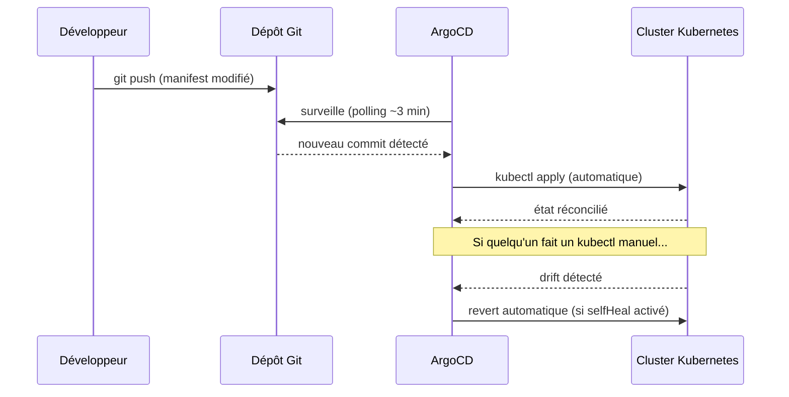
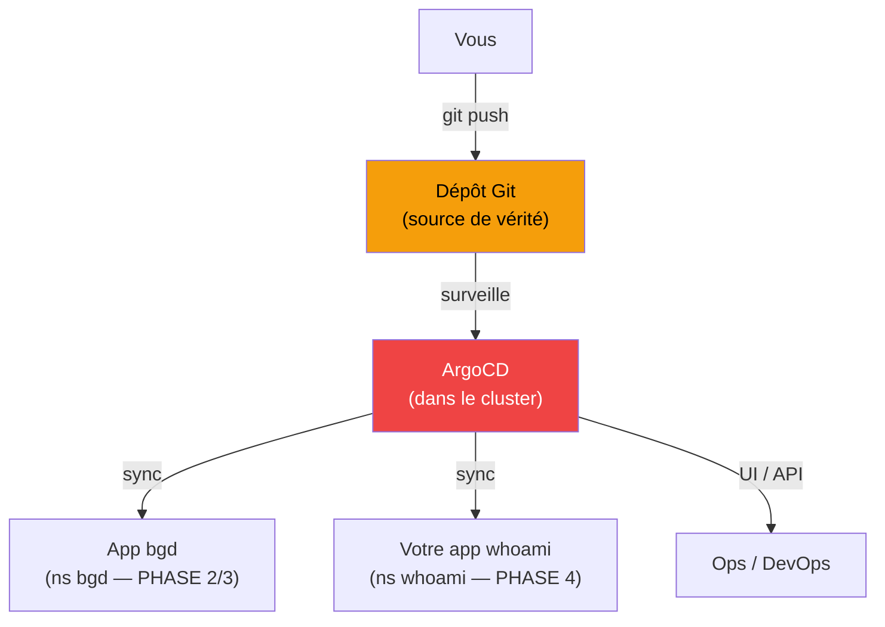

# 02 — Introduction à ArgoCD : GitOps et déploiement continu

> **Scénario à réaliser en autonomie** (cas un peu à part : installation d'un outil + prise en main d'une UI, donc plus « suivez le fil » que les autres). Vous complétez tout de même le manifest `Application` (`# TODO`), et vous poussez vos **propres** manifests dans **votre propre dépôt git**.

Prérequis : vous savez déployer des ressources Kubernetes à la main avec `kubectl apply`. On introduit maintenant une approche différente : le **GitOps** avec ArgoCD.

> **Tutoriel de référence :** ce TP s'inspire du tutoriel RedHat — [ArgoCD Tutorial: Getting Started](https://redhat-scholars.github.io/argocd-tutorial/argocd-tutorial/02-getting_started.html).

> **Prérequis cluster :** minikube démarré, addon ingress actif

---

## ✨ Objectifs

- Comprendre le **GitOps** : git comme unique source de vérité
- Installer ArgoCD et accéder à son **UI**
- Déployer une app via une **Application** ArgoCD (repo public `bgd`)
- Observer un **configuration drift** puis activer le **self-healing** (revert auto)
- **Ouverture :** rejouer le même cycle GitOps avec **votre propre dépôt git**

---

# PHASE 0 — GitOps : le concept

## Le problème du `kubectl apply` manuel

Jusqu'ici, le workflow ressemble à ceci :

```
Modifier un manifest YAML  ->  kubectl apply  ->  cluster mis à jour
```

Ça marche, mais en équipe ça montre ses limites (même avec un pipeline CI/CD) :

- **Qui a appliqué quoi ?** Aucune trace si on ne commit pas systématiquement les fichiers de configs finaux (la CI/CD génère ou personnalise peut être des fichiers de configs à la volée).
- **Le cluster est-il synchronisé avec git ?** Quelqu'un a peut-être fait un `kubectl` en direct.
- **Comment revenir en arrière ?** `kubectl rollout undo`, même si le YAML dans git n'a pas bougé.
- **Environnements multiples ?** Staging, prod — appliquer à la main sur chacun = source d'erreurs.

## La réponse : GitOps

Le principe du **GitOps** : **git est l'unique source de vérité**.

- On ne fait plus (idéalement) de `kubectl apply` à la main.
- On commit les manifests dans git.
- Un outil (ArgoCD) surveille le repo et **réconcilie automatiquement** le cluster avec l'état défini dans git.



## ArgoCD en un mot

**ArgoCD** est un contrôleur Kubernetes qui implémente le GitOps :

- il tourne **dans** le cluster (comme des pods) ;
- il surveille un ou plusieurs dépôts git ;
- il compare l'état git avec l'état réel (**diff**) ;
- il applique les changements (**sync**), automatiquement ou sur demande ;
- il expose une **UI web** pour tout piloter.

---

# PHASE 1 — Installer ArgoCD

## Etape 1 — Vérifier les prérequis

```bash
minikube status
minikube addons list | grep ingress
# ingress   : enabled ✅
```

Si l'ingress n'est pas actif :

```bash
minikube addons enable ingress
kubectl get pods -n ingress-nginx     # attendre Running
```

---

## Etape 2 — Installer ArgoCD

ArgoCD se déploie dans son propre namespace via un manifest officiel.

```bash
kubectl create namespace argocd
kubectl apply --server-side -n argocd -f https://raw.githubusercontent.com/argoproj/argo-cd/stable/manifests/install.yaml
```

Cette commande crée une vingtaine de ressources (Deployments, Services, ConfigMaps, RBAC, CRDs...).

> ⚠️ **Pourquoi `--server-side` ?** Sans lui, vous obtenez :
> ```
> The CustomResourceDefinition "applicationsets.argoproj.io" is invalid:
>   metadata.annotations: Too long: may not be more than 262144 bytes
> ```
> **Cause :** un `kubectl apply` classique (client-side) enregistre tout le manifest dans l'annotation `kubectl.kubernetes.io/last-applied-configuration`. Or la CRD `applicationsets` fait à elle seule ~1,4 Mo — bien au-delà de la limite de 256 Ko des annotations.
> **Correctif :** `--server-side` fait calculer le diff **par l'API server** (pas d'annotation stockée), ce qui contourne la limite. C'est d'ailleurs la méthode recommandée par ArgoCD pour l'installation.
> **À noter :** ce problème est apparu avec ArgoCD **v3.3.0** (la CRD `applicationsets` a grossi) — voir l'issue [argoproj/argo-cd#26264](https://github.com/argoproj/argo-cd/issues/26264).

Attendre que le serveur soit prêt (2-3 min) :

```bash
kubectl rollout status deploy/argocd-server -n argocd
watch kubectl get pods -n argocd
```

On doit voir ~7 pods `Running` :

```
argocd-application-controller-0            1/1   Running
argocd-applicationset-controller-xxx       1/1   Running
argocd-dex-server-xxx                      1/1   Running
argocd-notifications-controller-xxx        1/1   Running
argocd-redis-xxx                           1/1   Running
argocd-repo-server-xxx                     1/1   Running
argocd-server-xxx                          1/1   Running
```

---

## Etape 3 — Exposer l'UI ArgoCD

Le service `argocd-server` est en `ClusterIP` par défaut. Deux options pour l'atteindre.

**Option A — Ingress sur `argocd.local`** (cohérent avec les labs précédents).

ArgoCD sert son UI en HTTPS. Pour simplifier en local, on désactive TLS côté ArgoCD (l'Ingress gère le HTTP) :

```bash
kubectl patch configmap argocd-cmd-params-cm -n argocd --type merge \
  -p '{"data": {"server.insecure": "true"}}'
kubectl rollout restart deployment argocd-server -n argocd
kubectl rollout status deployment argocd-server -n argocd
```

Créer `argocd-ingress.yaml` :

```yaml
apiVersion: networking.k8s.io/v1
kind: Ingress
metadata:
  name: argocd-ingress
  namespace: argocd
  annotations:
    nginx.ingress.kubernetes.io/backend-protocol: "HTTP"
spec:
  rules:
  - host: argocd.local
    http:
      paths:
      - pathType: Prefix
        path: "/"
        backend:
          service:
            name: argocd-server
            port:
              number: 80
```

```bash
kubectl apply -f argocd-ingress.yaml
echo "$(minikube ip)  argocd.local" | sudo tee -a /etc/hosts
# ou avec minikube tunnel actif :  echo "127.0.0.1  argocd.local" | sudo tee -a /etc/hosts
```

**Option B — port-forward** (plus rapide, sans Ingress ni /etc/hosts) :

```bash
kubectl port-forward svc/argocd-server -n argocd 8080:443
# UI dispo sur https://localhost:8080 (accepter le certificat auto-signé)
```

---

## Etape 4 — Premier login

ArgoCD génère un mot de passe admin aléatoire à l'installation, stocké dans un Secret :

```bash
kubectl -n argocd get secret argocd-initial-admin-secret \
  -o jsonpath="{.data.password}" | base64 -d ; echo
```

Se connecter à l'UI ([http://argocd.local](http://argocd.local) ou [https://localhost:8080](https://localhost:8080)) :

- **Username** : `admin`
- **Password** : le mot de passe ci-dessus

> **Changez le mot de passe** après connexion : **User Info > Update Password**.

### (Optionnel) CLI ArgoCD

```bash
# macOS
brew install argocd
# Linux
curl -sSL -o /usr/local/bin/argocd \
  https://github.com/argoproj/argo-cd/releases/latest/download/argocd-linux-amd64 && chmod +x /usr/local/bin/argocd

ARGO_PASS=$(kubectl -n argocd get secret argocd-initial-admin-secret -o jsonpath="{.data.password}" | base64 -d)
argocd login argocd.local --username admin --password "$ARGO_PASS" --insecure
```

---

# PHASE 2 — Déployer une application avec ArgoCD

On utilise l'app de démo **bgd** (Blue Green Demo, des bulles colorées) du dépôt **public** RedHat. C'est un exemple public, prêt à l'emploi, qui permet de se concentrer sur ArgoCD **sans se soucier des credentials d'accès au repo**.

> **Pourquoi pas tout de suite votre propre repo ?** Pointer ArgoCD vers votre repo demande de le créer (et parfois de gérer des credentials). On fait d'abord **tout le parcours GitOps** sur ce repo public — déploiement, drift, self-heal — puis en **PHASE 4** (ouverture) vous rejouerez exactement le même schéma avec **votre propre dépôt**.

## Etape 5 — Créer l'Application ArgoCD

Une **Application** est la ressource centrale d'ArgoCD : elle lie un dépôt git (source) à un namespace Kubernetes (destination) et définit la politique de synchronisation.

### Via l'UI

Dans ArgoCD : **+ New App**, puis :

| Champ | Valeur |
|---|---|
| **Application Name** | `bgd-app` |
| **Project** | `default` |
| **Sync Policy** | `Automatic` |
| **Repository URL** | `https://github.com/redhat-developer-demos/openshift-gitops-examples` |
| **Revision** | `minikube` |
| **Path** | `apps/bgd/overlays/bgd` |
| **Cluster URL** | `https://kubernetes.default.svc` |
| **Namespace** | `bgd` |
| **Auto-create namespace** | ✅ |

Cliquer sur **Create**.

### Via un manifest YAML (équivalent)

Récupérez [assets/attachments/k8s/argocd/bgd-app.yaml](assets/attachments/k8s/argocd/bgd-app.yaml) :

```yaml
apiVersion: argoproj.io/v1alpha1
kind: Application
metadata:
  name: bgd-app
  namespace: argocd
spec:
  destination:
    namespace: bgd
    server: https://kubernetes.default.svc
  project: default
  source:
    path: apps/bgd/overlays/bgd
    repoURL: https://github.com/redhat-developer-demos/openshift-gitops-examples
    targetRevision: minikube
  syncPolicy:
    automated:
      prune: true
      selfHeal: false
    syncOptions:
    - CreateNamespace=true
```

```bash
kubectl apply -f bgd-app.yaml
```

> **`kind: Application`** est une **CRD** ArgoCD (pas du Kubernetes natif) — enregistrée à l'installation d'ArgoCD.

> 📖 [ArgoCD — Application (declarative setup)](https://argo-cd.readthedocs.io/en/stable/operator-manual/declarative-setup/#applications)

---

## Etape 6 — Observer le déploiement

Dans l'UI, `bgd-app` passe **Syncing** → **Healthy / Synced**. ArgoCD affiche le **graphe** de toutes les ressources créées (Deployment, ReplicaSet, Pods, Service...) et leur état en temps réel.

Côté Kubernetes :

```bash
kubectl get all -n bgd
kubectl rollout status deploy/bgd -n bgd
```

### Accéder à l'app bgd

```bash
kubectl port-forward svc/bgd 8080:8080 -n bgd
# http://localhost:8080 -> des bulles BLEUES
```

> **Pourquoi port-forward et pas un Ingress ?** L'app bgd du tuto RedHat a son propre Ingress configuré pour un autre hostname. Pour rester simple, on utilise le port-forward ici.

---

# PHASE 3 — GitOps en action

C'est là que ça devient intéressant. On observe les deux comportements fondamentaux du GitOps, **sur l'app bgd**.

## Etape 7 — Simuler un configuration drift

Le **configuration drift** : l'état réel du cluster diverge de git — typiquement, quelqu'un modifie une ressource directement avec `kubectl`, hors git.

### Provoquer un drift manuellement

```bash
# Changer la couleur des bulles directement sur le cluster (hors git)
kubectl -n bgd patch deploy/bgd --type='json' \
  -p='[{"op": "replace", "path": "/spec/template/spec/containers/0/env/0/value", "value":"green"}]'
```

Recharger [http://localhost:8080](http://localhost:8080) → les bulles sont maintenant **vertes**.

### Observer dans ArgoCD

L'app passe **OutOfSync** ⚠️ — ArgoCD a détecté que le cluster ne correspond plus à git. Cliquez sur l'app pour voir le **diff** : ArgoCD affiche exactement ce qui diverge (git dit `blue`, cluster dit `green`).

### Resynchroniser manuellement

```bash
argocd app sync bgd-app        # ou bouton "Sync" dans l'UI
```

Les bulles repassent **bleues** — ArgoCD a réappliqué l'état défini dans git.

---

## Etape 8 — Activer le Self-Healing

Plutôt que de resync à la main, ArgoCD peut **revert automatiquement** tout changement hors-git. C'est le **self-healing**.

```bash
kubectl patch application/bgd-app -n argocd --type=merge \
  -p='{"spec":{"syncPolicy":{"automated":{"prune":true,"selfHeal":true}}}}'
```

Reproduire le drift :

```bash
kubectl -n bgd patch deploy/bgd --type='json' \
  -p='[{"op": "replace", "path": "/spec/template/spec/containers/0/env/0/value", "value":"green"}]'
```

Observer dans l'UI : en quelques secondes, ArgoCD détecte le drift et re-sync **tout seul**. Les bulles repassent bleues sans intervention.

> ⚖️ **Self-heal en production : puissant mais à manier avec soin.** Tout ce que vous voulez changer doit passer par git — sinon ArgoCD écrase les changements manuels d'urgence. C'est le prix (assumé) du « git = source de vérité ».

---

## Récap

| Concept | Description |
|---|---|
| **Application ArgoCD** | Lie un `path` git à un namespace Kubernetes |
| **Sync** | Applique l'état git sur le cluster |
| **OutOfSync** | Le cluster a divergé de git |
| **Self-heal** | Revert automatique de tout changement hors-git |
| **Prune** | Supprime du cluster ce qui n'existe plus dans git |

---

# PHASE 4 — Ouverture : à vous, avec VOTRE dépôt

Vous avez fait tout le parcours GitOps (déploiement, drift, self-heal) sur l'app publique `bgd`. **Rejouez maintenant exactement le même schéma avec vos propres manifests whoami**, hébergés dans **votre propre dépôt git**.

> **Pas de serveur GitLab d'entreprise ici** : chacun crée **son propre dépôt** — GitHub, GitLab.com, ou un Gitea/GitLab auto-hébergé. Un **repo public** évite toute config de credentials (recommandé). Pour un repo privé, voir le Bonus.

## Etape 9 — Créer et pousser votre dépôt

1. Créez un dépôt **public** vide chez votre hébergeur (ex. GitHub : `whoami-k8s`).
2. Poussez vos manifests whoami du lab 01 :

```bash
cd 1.whoami          # ou 01-whoami selon votre nommage
git init
git add .
git commit -m "manifests whoami"
git branch -M main
git remote add origin https://github.com/<vous>/whoami-k8s.git
git push -u origin main
```

> ⚠️ **Cohérence des manifests.** Vos YAML poussés doivent créer le namespace `whoami` **ou** laisser l'Application le créer (`CreateNamespace=true`). Retirez du repo ce qui ne doit pas être synchronisé (ex. `whoami.hpa.yaml` si vous le gérez à part).

## Etape 10 — Créer l'Application pointant sur votre repo

### 🚧 À compléter

Récupérez [assets/attachments/k8s/argocd/whoami-app.yaml](assets/attachments/k8s/argocd/whoami-app.yaml) et complétez les `# TODO` avec **l'URL de votre dépôt** :

```yaml
apiVersion: argoproj.io/v1alpha1
kind: Application
metadata:
  name: whoami-gitops
  namespace: argocd
spec:
  project: default
  source:
    repoURL: ____________          # TODO : URL de VOTRE dépôt (…/whoami-k8s.git)
    targetRevision: ____________   # TODO : branche (main)
    path: ____________             # TODO : dossier des manifests dans le repo (. ou 1.whoami)
  destination:
    server: https://kubernetes.default.svc
    namespace: ____________        # TODO : ns cible (whoami)
  syncPolicy:
    automated:
      prune: ____________          # TODO : true (supprime du cluster ce qui disparaît de git)
      selfHeal: ____________       # TODO : true (self-heal, comme à l'étape 8)
    syncOptions:
    - CreateNamespace=true
```

> **`path`** : si vous avez `git init` **dans** `1.whoami/`, les manifests sont à la racine du repo → `path: .`. Sinon `path: 1.whoami`.

```bash
kubectl apply -f whoami-app.yaml
```

## Etape 11 — Boucler le cycle GitOps

Refaites, sur **votre** app, ce que vous avez vu sur bgd :

- **Sync depuis git** : modifiez `replicas` dans `whoami.deployment.yaml`, `git commit` + `git push` → ArgoCD applique (refresh dans l'UI ou polling ~3 min).
- **Drift + self-heal** : `kubectl scale deployment whoami --replicas=1 -n whoami` (hors git) → ArgoCD détecte l'`OutOfSync` et revert automatiquement.

> **Vous avez bouclé la boucle GitOps de bout en bout, sur votre propre code.** C'est exactement ce workflow qu'on industrialise en production.

---

## Bonus — Repo privé (credentials)

Pour un dépôt **privé**, ArgoCD a besoin d'un accès en lecture.

**GitHub** — créer un *Personal Access Token* (scope `repo` en lecture) puis :

```bash
argocd repo add https://github.com/<vous>/whoami-k8s.git \
  --username <vous> --password <TOKEN>
```

**GitLab (self-hosted / .com)** — *Settings > Repository > Deploy tokens*, scope `read_repository` :

```bash
argocd repo add https://gitlab.example.com/<groupe>/<projet>.git \
  --username <deploy-token-name> --password <deploy-token-value> \
  --insecure-skip-server-verification
```

> Ne committez **jamais** un token dans le repo. Les credentials vivent dans ArgoCD (Secret), pas dans git.

---

## Vue d'ensemble



---

## Pour aller plus loin

| Sujet | Ressource |
|---|---|
| Tutoriel complet ArgoCD (RedHat) | [redhat-scholars.github.io/argocd-tutorial](https://redhat-scholars.github.io/argocd-tutorial/argocd-tutorial/01-setup.html) |
| ArgoCD — doc officielle | [argo-cd.readthedocs.io](https://argo-cd.readthedocs.io) |
| Argo Rollouts — Blue/Green & Canary natifs | [argoproj.github.io/argo-rollouts](https://argoproj.github.io/argo-rollouts/) |
| FluxCD — alternative GitOps | [fluxcd.io](https://fluxcd.io) |
| OpenGitOps — principes de référence | [opengitops.dev](https://opengitops.dev) |
| Erreur d'install `Too long` (CRD applicationsets) | [argoproj/argo-cd#26264](https://github.com/argoproj/argo-cd/issues/26264) |

➡️ **Suite : [03 — Compléments : Isolation réseau, Quotas & LimitRange](3-K8S-COMPLEMENTS-NAMESPACES.md)**
