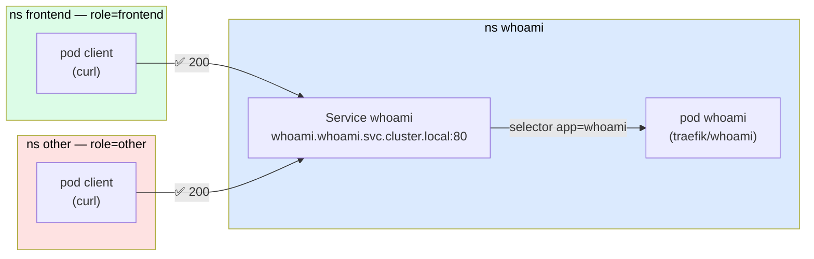
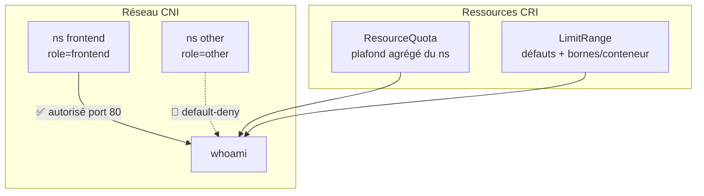

# 03 — Kubernetes : compléments (Isolation réseau, Quotas & LimitRange)

> **Scénario à réaliser en autonomie.** Vous complétez vous-même les manifests à partir d'indices : les fichiers fournis dans `assets/attachments/k8s/` contiennent des `# TODO` à remplir. Un dossier `solution/` (à la fin) n'est là qu'en dernier recours.

Ce TP prolonge le [lab 01](1-K8S-INTRO.md). On y a vu les briques de déploiement (namespace, pod, service, ingress, deployment, HPA). On complète maintenant avec deux préoccupations centrales de la **gestion multi-app d'un cluster** :

1. **L'isolation réseau** — qui a le droit de parler à qui ? (NetworkPolicy + notion de **CNI**)
2. **La maîtrise des ressources** — combien un namespace a-t-il le droit de consommer ? (ResourceQuota + LimitRange, et un mot sur le **CRI**)

---

## ✨ Objectifs

- Comprendre le rôle du **CNI** et pourquoi il conditionne les NetworkPolicy
- Écrire une stratégie **default-deny + allow sélectif** et la voir bloquer réellement du trafic
- Utiliser l'éditeur visuel [editor.networkpolicy.io](https://editor.networkpolicy.io/) pour concevoir puis exporter des policies
- Poser un **ResourceQuota** (plafond agrégé du namespace) et un **LimitRange** (bornes par conteneur)
- Comprendre le lien **LimitRange ↔ ResourceQuota** (et le piège du refus de pod)
- Situer le **CRI** dans l'application concrète des limites

---

## 📁 Point de départ

On réutilise l'app **whoami** du lab 01.

> **Nommage :** dans le lab 01, le dossier s'appelle `1.whoami`. Si vous avez suivi une autre convention en local (`01-whoami`...), utilisez la vôtre — remplacez `1.whoami` par votre nom de dossier partout dans ce guide.

Arborescence cible à la fin de ce TP :

```
1.whoami/                        (ou 01-whoami/ selon votre nommage)
├── whoami.ns.yaml
├── whoami.deployment.yaml
├── whoami.svc.yaml
├── whoami.ingress.yml
├── whoami.hpa.yaml
├── quotas/
│   ├── whoami.resourcequota.yaml     ← section 7 à écrire
│   └── whoami.limitrange.yaml        ← section 8 à écrire
└── networkpolicies/
    ├── 00-default-deny-ingress.yaml  ← section 3 à écrire
    ├── 01-allow-frontend.yaml        ← section 4 à écrire
    └── clients.yaml                  ← fourni (2 ns de test)
```

---

# Partie A — Isolation réseau

## 🌐 1 — Le CNI : la couche qui rend le réseau possible

Kubernetes **ne fournit pas** le réseau des pods lui-même. Il délègue cette tâche à un **plugin CNI** (*Container Network Interface*). Le CNI est le composant qui :

- attribue une **IP** à chaque pod,
- assure la **connectivité** pod-à-pod à travers les nœuds,
- **applique (ou non) les NetworkPolicy**.

| Sans CNI compatible NetworkPolicy | Avec CNI compatible |
|---|---|
| Les pods communiquent tous librement (flat network) | Idem par défaut... |
| Une `NetworkPolicy` est **acceptée mais ignorée** | ...mais une `NetworkPolicy` est **réellement appliquée** |

> 📖 [Kubernetes — Network Plugins (CNI)](https://kubernetes.io/docs/concepts/extend-kubernetes/compute-storage-net/network-plugins/)

**Quelques CNI courants** (connaître le paysage, pas seulement un outil) :

| CNI | NetworkPolicy | Particularité |
|---|---|---|
| **Calico** | ✅ | Le plus répandu, policies L3/L4 (+ extensions) |
| **Cilium** | ✅ | Basé eBPF, policies L3→L7 (HTTP, gRPC...) |
| **Flannel** | ❌ | Simple, mais **n'applique pas** les NetworkPolicy |
| **kindnet / bridge (minikube défaut)** | ❌ | Suffisant pour démarrer, ignore les policies |

> ⚠️ **Le piège classique de minikube.** Le CNI par défaut de minikube **n'applique PAS** les NetworkPolicy. Vous pouvez `kubectl apply` une policy « default-deny », `kubectl get networkpolicy` la montrera bien... et pourtant tout le trafic passera. Pour *démontrer* réellement l'isolation, il faut un CNI qui la supporte — on utilise **Calico** ci-dessous.

### 💡 Démarrer un cluster minikube avec Calico

Pour ne pas perturber le cluster du lab 01, on crée un **profil minikube dédié** :

```bash
minikube start -p calico-lab --cni=calico --memory=2200 --cpus=2
```

Vérifier que Calico tourne (attendre que les pods soient `Running`, ~1-2 min) :

```bash
kubectl --context calico-lab get pods -n kube-system | grep calico
# calico-kube-controllers-xxx   1/1   Running
# calico-node-xxx               1/1   Running
```

> **Astuce contexte :** `--context calico-lab` cible ce cluster sans changer votre contexte courant. Pour basculer durablement : `kubectl config use-context calico-lab` (et `kubectl config use-context minikube` pour revenir).

---

## 🧩 2 — Déployer whoami + les clients de test sur `calico-lab`

On déploie whoami (namespace `whoami`) et deux namespaces « clients » qui serviront de cobayes.

Déployez d'abord whoami sur ce cluster (réutilisez vos manifests du lab 01) :

```bash
kubectl --context calico-lab apply -f 1.whoami/whoami.ns.yaml
kubectl --context calico-lab apply -f 1.whoami/whoami.deployment.yaml
kubectl --context calico-lab apply -f 1.whoami/whoami.svc.yaml
kubectl --context calico-lab -n whoami rollout status deploy/whoami
```

Puis les deux clients — récupérez le fichier fourni [assets/attachments/k8s/networkpolicies/clients.yaml](assets/attachments/k8s/networkpolicies/clients.yaml) et copiez-le dans `1.whoami/networkpolicies/clients.yaml` :

- `frontend` : namespace labellisé `role: frontend` (sera **autorisé**)
- `other` : namespace labellisé `role: other` (sera **bloqué**)

```bash
kubectl --context calico-lab apply -f 1.whoami/networkpolicies/clients.yaml
kubectl --context calico-lab -n frontend wait --for=condition=Ready pod/client --timeout=90s
kubectl --context calico-lab -n other    wait --for=condition=Ready pod/client --timeout=90s
```

> **D'où vient `wait --for=condition=Ready` ?** Chaque objet Kubernetes publie son état dans un champ `status.conditions` — une liste de conditions typées (`PodScheduled`, `Initialized`, `ContainersReady`, `Ready`...) que le pod passe à `True` au fur et à mesure de son cycle de vie. `Ready` signifie « le pod est démarré ET répond à ses readiness checks », donc joignable. `kubectl wait --for=condition=Ready` **bloque** jusqu'à ce que cette condition soit `True` (ou que `--timeout` expire) — pratique pour ne tester la connectivité qu'une fois le pod réellement prêt, au lieu d'enchaîner des `kubectl get` manuels.
> ```bash
> # voir les conditions d'un pod :
> kubectl -n frontend get pod client -o jsonpath='{.status.conditions}' | jq
> ```
> 📖 [Pod lifecycle — Pod conditions](https://kubernetes.io/docs/concepts/workloads/pods/pod-lifecycle/#pod-conditions)

### 🗺️ L'archi avec les namespaces (avant policies)

Trois namespaces, deux clients, un service cible. Aucune barrière encore — tout le monde peut joindre whoami :



> C'est l'état de départ. Aux sections 3 et 4, on ajoutera des NetworkPolicy pour couper `other` tout en gardant `frontend`.

### 🧪 Manip — l'état AVANT toute policy

Testez la connectivité des deux clients vers whoami. Pour communiquer avec un service sur un autre namespace on peut utiliser son FQDN DNS interne. Par exemple, pour contacter le service `whoami` (qui vit dans le namespace `whoami`) depuis les namespaces `frontend`/`other`, on utilise le nom `whoami.whoami.svc.cluster.local` (voir plus bas pour l'usage détaillé). Sans policy, **tout passe** (Calico est permissif par défaut) :

```bash
# frontend -> whoami
kubectl --context calico-lab -n frontend exec client -- \
  curl -s -m 5 -o /dev/null -w "%{http_code}\n" http://whoami.whoami.svc.cluster.local
# => 200

# other -> whoami
kubectl --context calico-lab -n other exec client -- \
  curl -s -m 5 -o /dev/null -w "%{http_code}\n" http://whoami.whoami.svc.cluster.local
# => 200
```

Les deux répondent `200`. Retenez ce résultat : on va le faire changer.

> **D'où vient le nom `whoami.whoami.svc.cluster.local` ?** C'est le **FQDN DNS interne** d'un Service, résolu par le DNS du cluster (CoreDNS). Il suit toujours le même patron :
>
> ```
>   whoami   .   whoami   .   svc   .   cluster.local
>  <service>    <namespace>   <type>    <suffixe du cluster>
> ```
>
> | Segment | Valeur ici | Rôle |
> |---|---|---|
> | `<service>` | `whoami` | nom de l'objet Service |
> | `<namespace>` | `whoami` | namespace où vit le Service (d'où le doublon) |
> | `svc` | `svc` | indique une ressource de type Service |
> | `<suffixe>` | `cluster.local` | domaine du cluster (par défaut) |
>
> **Formes courtes** (grâce au `search` DNS injecté dans `/etc/resolv.conf` des pods) : depuis un pod **du même namespace**, `whoami` suffit ; depuis un **autre namespace**, `whoami.whoami` suffit. On écrit le FQDN complet ici pour être explicite (les clients sont dans `frontend`/`other`, pas dans `whoami`).
> 📖 [DNS for Services and Pods](https://kubernetes.io/docs/concepts/services-networking/dns-pod-service/)

---

## 🔒 3 — Couper tout le trafic entrant (default-deny)

Le point de départ d'une posture **zero-trust** : on ferme tout, puis on rouvre au cas par cas.

Une `NetworkPolicy` avec un `podSelector: {}` (= tous les pods du namespace) et un `policyTypes: [Ingress]` **sans aucune règle `ingress`** signifie : « aucune source n'est autorisée à entrer ».

> **Pourquoi ça bloque ?** Dès qu'**au moins une** policy sélectionne un pod en `Ingress`, ce pod bascule en « deny par défaut » : seul ce que les policies **autorisent explicitement** passe. Pas de règle `ingress` = rien d'autorisé.

### 🚧 À compléter

Récupérez [assets/attachments/k8s/networkpolicies/00-default-deny-ingress.yaml](assets/attachments/k8s/networkpolicies/00-default-deny-ingress.yaml) dans `1.whoami/networkpolicies/` et complétez le `# TODO` :

```yaml
apiVersion: networking.k8s.io/v1
kind: NetworkPolicy
metadata:
  name: default-deny-ingress
  namespace: whoami
spec:
  podSelector: {}            # {} = TOUS les pods du namespace
  policyTypes:
  - ____________             # TODO : quel sens de trafic on ferme ? (Ingress / Egress)
```

> 📖 [Kubernetes — Default deny all ingress traffic](https://kubernetes.io/docs/concepts/services-networking/network-policies/#default-deny-all-ingress-traffic)

Appliquez :

```bash
kubectl --context calico-lab apply -f 1.whoami/networkpolicies/00-default-deny-ingress.yaml
```

### 🧪 Manip — plus personne ne passe

On rejoue la commande pour contacter notre whoami depuis un autre namespace (`frontend`), via son FQDN DNS interne :

```bash
kubectl --context calico-lab -n frontend exec client -- \
  curl -s -m 5 -o /dev/null -w "%{http_code}\n" http://whoami.whoami.svc.cluster.local || echo "(timeout — attendu)"
# => 000 / timeout (exit 28)
```

`frontend` est maintenant **coupé** lui aussi. Normal : on n'a encore rien réautorisé.

---

## ✅ 4 — Rouvrir sélectivement (allow-frontend)

On autorise **uniquement** le namespace `role=frontend` à joindre whoami, **sur le port 80**.

Pour cela, on ajoute une NetworkPolicy avec une **règle `ingress`** : contrairement au default-deny (qui n'avait aucune règle), celle-ci déclare une liste `from` de sources explicitement autorisées. Tout ce qui n'est pas listé reste bloqué. Le point délicat est justement d'écrire correctement ces sources.

La section `ingress.from` d'une NetworkPolicy est une **liste** (`-`) de sources autorisées. Chaque entrée peut combiner `namespaceSelector` et/ou `podSelector`. La subtilité — et le cœur du sujet — c'est la **structure des tirets** :

```yaml
ingress:
- from:
  # === CAS 1 : ET (un seul tiret) ===
  # les pods role=client, MAIS SEULEMENT dans les namespaces role=frontend
  - namespaceSelector:
      matchLabels:
        role: frontend
    podSelector:              # même tiret que namespaceSelector -> ET
      matchLabels:
        role: client

  # === CAS 2 : OU (deux tirets séparés) ===
  # tous les pods des namespaces role=frontend  OU  tous les pods role=client (n'importe où)
  - namespaceSelector:
      matchLabels:
        role: frontend
  - podSelector:              # nouveau tiret -> nouvelle source -> OU
      matchLabels:
        role: client
```

Décomposition des sélecteurs de source :

| Champ dans `from:` | Ce qu'il filtre |
|---|---|
| `namespaceSelector` | les **namespaces** source (par leurs labels) |
| `podSelector` | les **pods** source (par leurs labels) |
| les deux dans la **même** entrée `-` | pods correspondants **DANS** les namespaces correspondants (ET logique) |
| deux entrées `-` séparées | union (OU logique) |

> ⚠️ **Piège fréquent :** `namespaceSelector` + `podSelector` sous le **même tiret** = ET. Sous **deux tirets** = OU. Une erreur ici ouvre bien plus (ou bien moins) que prévu.

Dans notre cas c'est le plus simple : **une seule source**, un `namespaceSelector` sur `role=frontend` (pas de `podSelector`, donc tous les pods de ce namespace).

### 🚧 À compléter

Récupérez [assets/attachments/k8s/networkpolicies/01-allow-frontend.yaml](assets/attachments/k8s/networkpolicies/01-allow-frontend.yaml) et complétez :

```yaml
apiVersion: networking.k8s.io/v1
kind: NetworkPolicy
metadata:
  name: allow-frontend
  namespace: whoami
spec:
  podSelector:
    matchLabels:
      app.kubernetes.io/name: ____________   # TODO : pods CIBLES (ex: whoami)
  policyTypes:
  - Ingress
  ingress:
  - from:
    - ____________:                   # TODO : on filtre la SOURCE par namespace
        matchLabels:
          role: ____________          # TODO : label du ns autorisé (ex: frontend)
    ports:
    - protocol: TCP
      port: ____________              # TODO : port autorisé (ex: 80)
```

> 📖 [Kubernetes — NetworkPolicy resource (ingress `from`)](https://kubernetes.io/docs/concepts/services-networking/network-policies/#the-networkpolicy-resource)

Appliquez :

```bash
kubectl --context calico-lab apply -f 1.whoami/networkpolicies/01-allow-frontend.yaml
```

### 🧪 Manip — l'isolation en action

```bash
# frontend est AUTORISÉ
kubectl --context calico-lab -n frontend exec client -- \
  curl -s -m 5 -o /dev/null -w "%{http_code}\n" http://whoami.whoami.svc.cluster.local
# => 200  ✅

# other est BLOQUÉ (aucune policy ne l'autorise)
kubectl --context calico-lab -n other exec client -- \
  curl -s -m 5 -o /dev/null -w "%{http_code}\n" http://whoami.whoami.svc.cluster.local || echo "(timeout — attendu)"
# => 000 / timeout  🚫
```

**C'est le résultat clé du TP** : `frontend` → 200, `other` → bloqué. La même app, deux clients, un seul autorisé — par label de namespace.

> **Symptôme → Cause → Correctif.** Si `frontend` est *aussi* bloqué après la section 4 : vérifiez le label du namespace (`kubectl get ns frontend --show-labels` doit montrer `role=frontend`) et que le `namespaceSelector` de la policy pointe bien sur `role: frontend`. Un label absent = aucune source ne matche = tout reste coupé.

---

## 🎨 5 — Concevoir visuellement avec l'éditeur (démo live)

Écrire des NetworkPolicy à la main devient vite illisible. L'outil [editor.networkpolicy.io](https://editor.networkpolicy.io/) permet de **dessiner** la policy (sources, cibles, ports) et d'**exporter le YAML**.

**Démo à suivre / à refaire :**

1. Ouvrir [editor.networkpolicy.io](https://editor.networkpolicy.io/)
2. Régler le **namespace cible** sur `whoami`, le **pod selector** sur `app.kubernetes.io/name = whoami`
3. Côté **Ingress**, ajouter une source `namespaceSelector` avec `role = frontend`, port `80`
4. Observer le **schéma** se mettre à jour (qui peut parler à qui)
5. Cliquer sur **YAML** : comparer avec votre `01-allow-frontend.yaml` — c'est le même objet
6. Bonus : ajouter une règle **Egress** (whoami autorisé à sortir vers le DNS `kube-dns` port 53) et observer l'impact

> 💡 L'éditeur est **hors-ligne / navigateur** : rien n'est envoyé à un cluster. C'est un outil de *conception* — le YAML exporté se `kubectl apply` ensuite comme d'habitude.

> ⚖️ **Remarque de conception.** Notre stratégie ne couvre que l'**Ingress**. En production on verrouille souvent aussi l'**Egress** (empêcher un pod compromis d'exfiltrer des données), mais attention : un default-deny egress casse la résolution DNS tant qu'on n'a pas explicitement rouvert le port 53 vers `kube-dns`. À creuser une fois les bases acquises.

---

# Partie B — Quotas & isolation des ressources

## 📦 6 — Le CRI, et pourquoi les limites sont « réelles »

Symétriquement au CNI (réseau), le **CRI** (*Container Runtime Interface*) est l'interface par laquelle kubelet pilote le **runtime de conteneurs** (containerd, CRI-O, ou docker via un shim). C'est le runtime, en s'appuyant sur les **cgroups** du noyau Linux, qui **fait réellement respecter** les `limits` CPU/mémoire d'un conteneur.

```
kubectl apply (limits) -> API -> kubelet -> [CRI] -> containerd/CRI-O -> cgroups (noyau) -> limite appliquée
```

| Interface | Domaine | Rôle |
|---|---|---|
| **CNI** | Réseau | IP des pods, connectivité, NetworkPolicy |
| **CRI** | Exécution | Lance/arrête les conteneurs, applique les limits via cgroups |
| **CSI** | Stockage | Provisionne les volumes (voir lab 04) |

> Vérifier le runtime de votre nœud :
> ```bash
> kubectl get nodes -o wide
> # colonne CONTAINER-RUNTIME : ex. docker://28.4.0, containerd://1.7.x ...
> ```

> **À retenir :** un `limits.memory: 128Mi` n'est pas une simple étiquette — quand le conteneur dépasse, le noyau (via le CRI + cgroups) l'**OOM-kill**. C'est concret.

Cette partie B se fait sur **n'importe quel cluster** (le CRI applique les limites indépendamment du CNI) — vous pouvez rester sur `calico-lab` ou revenir sur votre `minikube` du lab 01.

---

## 🧮 7 — ResourceQuota : plafonner un namespace

Un **ResourceQuota** impose un plafond **agrégé** à un namespace : la **somme** des requests/limits de tous les pods, et le **nombre** d'objets (pods, services, deployments...).

> **À quoi ça sert ?** Sur un cluster partagé entre équipes/projets, empêcher qu'un namespace monopolise le CPU/RAM du cluster (le fameux « voisin bruyant »).

Décomposition des clés :

| Clé du quota | Plafonne |
|---|---|
| `requests.cpu` / `requests.memory` | Somme des **requests** (ressources garanties réservées) |
| `limits.cpu` / `limits.memory` | Somme des **limits** (plafonds max) |
| `pods` | Nombre de pods |
| `services`, `count/deployments.apps` | Nombre d'objets par type |

### 🚧 À compléter

Récupérez [assets/attachments/k8s/quotas/whoami.resourcequota.yaml](assets/attachments/k8s/quotas/whoami.resourcequota.yaml) dans `1.whoami/quotas/` et complétez :

```yaml
apiVersion: v1
kind: ResourceQuota
metadata:
  name: whoami-quota
  namespace: whoami
spec:
  hard:
    requests.cpu: "____________"        # TODO ex: "1"
    requests.memory: "____________"     # TODO ex: 1Gi
    limits.cpu: "____________"          # TODO ex: "2"
    limits.memory: "____________"       # TODO ex: 2Gi
    pods: "____________"                # TODO ex: "5"
    services: "____________"            # TODO ex: "3"
    count/deployments.apps: "____________"  # TODO ex: "2"
```

> 📖 [Kubernetes — Resource Quotas](https://kubernetes.io/docs/concepts/policy/resource-quotas/)

Appliquez et inspectez la consommation :

```bash
kubectl apply -f 1.whoami/quotas/whoami.resourcequota.yaml
kubectl describe resourcequota whoami-quota -n whoami
# Resource                 Used   Hard
# --------                 ----   ----
# count/deployments.apps   1      2
# limits.cpu               ...    2
# pods                     ...    5
# requests.memory          ...    1Gi
```

La colonne `Used` vs `Hard` : votre tableau de bord de consommation du namespace.

---

## 🧷 8 — LimitRange : bornes par conteneur (et le piège du quota)

> ⚠️ **Le piège à vivre en premier.** Dès qu'un ResourceQuota impose `requests.*`/`limits.*`, **tout pod qui n'en déclare pas est REFUSÉ**. Démontrez-le :
> ```bash
> kubectl run naked --image=traefik/whoami -n whoami
> # Error from server (Forbidden): pods "naked" is forbidden: failed quota:
> #   whoami-quota: must specify limits.cpu,limits.memory,requests.cpu,requests.memory
> ```
> **Cause :** le quota exige des chiffres, le pod n'en donne aucun → rejet. **Correctif :** il vaut mieux un **LimitRange**, qui injecte des valeurs par défaut.

Un **LimitRange** agit **par conteneur** (pas en agrégé). Il :

- **injecte** `requests`/`limits` par défaut quand le conteneur n'en déclare pas (résout le piège ci-dessus),
- **refuse** les conteneurs hors des bornes `min`/`max`.

| Champ | Effet |
|---|---|
| `default` | `limits` injectées si absentes |
| `defaultRequest` | `requests` injectées si absentes |
| `max` | plafond par conteneur (refus au-delà) |
| `min` | plancher par conteneur (refus en-deçà) |

### 🚧 À compléter

Récupérez [assets/attachments/k8s/quotas/whoami.limitrange.yaml](assets/attachments/k8s/quotas/whoami.limitrange.yaml) et complétez :

```yaml
apiVersion: v1
kind: LimitRange
metadata:
  name: whoami-limits
  namespace: whoami
spec:
  limits:
  - type: Container
    default:
      cpu: "____________"           # TODO ex: 250m
      memory: "____________"        # TODO ex: 128Mi
    defaultRequest:
      cpu: "____________"           # TODO ex: 100m
      memory: "____________"        # TODO ex: 64Mi
    max:
      cpu: "____________"           # TODO ex: "1"
      memory: "____________"        # TODO ex: 512Mi
    min:
      cpu: "____________"           # TODO ex: 50m
      memory: "____________"        # TODO ex: 32Mi
```

> 📖 [Kubernetes — Limit Ranges](https://kubernetes.io/docs/concepts/policy/limit-range/)

Appliquez :

```bash
kubectl apply -f 1.whoami/quotas/whoami.limitrange.yaml
kubectl describe limitrange whoami-limits -n whoami
```

### 🧪 Manip 1 — l'injection des défauts

Le piège est résolu : un pod sans `resources` reçoit désormais les valeurs du LimitRange.

```bash
kubectl run naked --image=traefik/whoami -n whoami
kubectl get pod naked -n whoami -o jsonpath='{.spec.containers[0].resources}'; echo
# {"limits":{"cpu":"250m","memory":"128Mi"},"requests":{"cpu":"100m","memory":"64Mi"}}
kubectl delete pod naked -n whoami
```

### 🧪 Manip 2 — le quota qui plafonne un déploiement

Demandez plus que ce que le quota autorise et observez le rollout **partiel** :

```bash
kubectl create deployment greedy --image=traefik/whoami --replicas=6 -n whoami
# forcer des requests élevées pour saturer requests.memory (1Gi)
kubectl set resources deployment greedy -n whoami \
  --requests=cpu=100m,memory=300Mi --limits=cpu=200m,memory=400Mi
sleep 4
kubectl get deploy greedy -n whoami
# READY 2/6 ou 3/6 — bloqué par le quota (le chiffre exact dépend de l'état du ns)
kubectl describe rs -n whoami -l app=greedy | grep -i "exceeded quota" | head -1
# Error creating: pods ... forbidden: exceeded quota: whoami-quota, ...
#   (le plafond touché est requests.memory=1Gi OU pods=5, selon ce qui sature en premier)
kubectl delete deployment greedy -n whoami
```

> **Ce qui se passe :** Kubernetes crée des pods jusqu'à toucher **le premier plafond atteint** du quota (ici `requests.memory=1Gi` ou `pods=5` selon ce qui est déjà consommé dans le namespace), puis **refuse** les suivants. Le Deployment reste bloqué en-dessous de `6/6` : la demande dépasse le budget du namespace.

---

## 🎉 Challenge final

Sur le namespace `whoami`, vérifiez que vous savez répondre par une manip :

- [ ] Un pod `other` ne peut PAS joindre whoami, mais `frontend` oui (NetworkPolicy + Calico)
- [ ] Un pod sans `resources` est **refusé** si le quota est seul, **accepté** (avec défauts) si le LimitRange est présent
- [ ] Un déploiement à 6 replicas gourmands est **plafonné** par le ResourceQuota
- [ ] Vous savez expliquer, schéma à l'appui, la différence CNI / CRI / CSI

---

## ✅ Bonus

- **Egress default-deny** : ajouter une policy qui coupe la sortie, puis rouvrir le DNS (`kube-dns`, port 53 UDP/TCP) — indispensable pour que quoi que ce soit fonctionne encore.
- **Quota par PriorityClass** : `scopeSelector` pour n'appliquer le quota qu'aux pods d'une certaine priorité.
- **Quota sur le stockage** : `requests.storage`, `persistentvolumeclaims` (fait le lien avec le lab 04).
- **Policy L7 avec Cilium** : autoriser seulement `GET /whoami` et pas `POST` — impossible avec Calico L3/L4 seul.

---

## 🧹 Nettoyage

```bash
# Supprimer le cluster Calico dédié quand vous avez fini
minikube delete -p calico-lab

# Ou, pour garder le cluster mais nettoyer les objets de test :
kubectl delete ns frontend other
kubectl delete networkpolicy --all -n whoami
kubectl delete resourcequota whoami-quota -n whoami
kubectl delete limitrange whoami-limits -n whoami
```

---

## Récap



| Notion | Portée | Applique concrètement | Sans lui |
|---|---|---|---|
| **NetworkPolicy** | Namespace / pods | le **CNI** (Calico...) | policy ignorée |
| **ResourceQuota** | Agrégé du namespace | l'API server (admission) | pas de plafond |
| **LimitRange** | Par conteneur | l'API server (admission) | pod refusé si quota seul |
| **limits CPU/mém** | Par conteneur | le **CRI** + cgroups | pas de limite réelle |

---

## Pour aller plus loin

| Sujet | Ressource |
|---|---|
| NetworkPolicy — doc complète | [kubernetes.io/docs/concepts/services-networking/network-policies](https://kubernetes.io/docs/concepts/services-networking/network-policies/) |
| Éditeur visuel de policies | [editor.networkpolicy.io](https://editor.networkpolicy.io/) |
| Recettes de policies (cookbook) | [github.com/ahmetb/kubernetes-network-policy-recipes](https://github.com/ahmetb/kubernetes-network-policy-recipes) |
| Calico — doc | [docs.tigera.io/calico](https://docs.tigera.io/calico/latest/about/) |
| Cilium (eBPF, L7) | [cilium.io](https://cilium.io/) |
| Resource Quotas | [kubernetes.io/docs/concepts/policy/resource-quotas](https://kubernetes.io/docs/concepts/policy/resource-quotas/) |
| Limit Ranges | [kubernetes.io/docs/concepts/policy/limit-range](https://kubernetes.io/docs/concepts/policy/limit-range/) |
| CNI / CRI / CSI expliqués | [kubernetes.io/docs/concepts/extend-kubernetes](https://kubernetes.io/docs/concepts/extend-kubernetes/) |

➡️ **Suite : [04 — ConfigMaps](4-K8S-CONFIGMAPS.md)**
