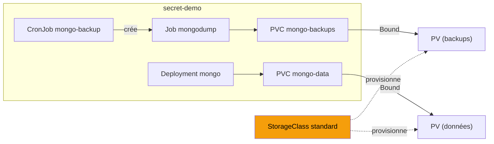

# 06 — Volumes & stockage persistant

> **Scénario à réaliser en autonomie.** Vous complétez vous-même les manifests à partir d'indices : les fichiers fournis dans `assets/attachments/k8s/storage/` contiennent des `# TODO` à remplir. Un dossier `solution/` (à la fin) n'est là qu'en dernier recours.

Ce lab **résout le problème laissé ouvert au [lab 05](5-K8S-SECRETS.md)** : le backup MongoDB disparaissait avec le pod du Job, et les données de la base elle-même repartaient de zéro à chaque redémarrage. La cause : tout vivait dans le système de fichiers **éphémère** des conteneurs. On introduit maintenant les **volumes persistants** pour rendre ces deux choses durables.

> **Prérequis cluster :** minikube démarré. On **continue dans le namespace `secret-demo`** du lab 05 (avec le Secret `mongo` déjà créé). Si vous l'avez supprimé, recréez-le : namespace + Secret `mongo` (voir lab 05, section 1).

---

## ✨ Objectifs

- Situer le **CSI** (Container Storage Interface) dans la famille CNI / CRI / CSI
- Comprendre la chaîne **PVC → StorageClass → PV** (provisioning dynamique)
- **Persister les données** de MongoDB : elles survivent à la mort du pod
- **Persister les backups** : le Job écrit dans un volume qui survit au Job
- Automatiser avec un **CronJob** de sauvegarde

---

## 📁 Point de départ

```
secret-demo/ (on prolonge le lab 05)
├── mongo-pvc.yaml          ← PVC pour les données mongo (à compléter)
├── mongo-persistent.yaml   ← MongoDB en Deployment + PVC (à compléter)
├── backup-pvc.yaml         ← PVC pour les backups (fourni)
├── backup-job-pvc.yaml     ← Job backup -> PVC (à compléter)
└── backup-cronjob.yaml     ← CronJob quotidien (fourni)
```

---

## 🧩 1 — Le CSI : l'interface de stockage

Comme pour le réseau (CNI, [lab 03](3-K8S-COMPLEMENTS-NAMESPACES.md)) et l'exécution (CRI), Kubernetes délègue le **stockage** à un plugin standardisé : le **CSI** (*Container Storage Interface*). C'est lui qui sait provisionner un volume sur le back-end concret (disque local, EBS AWS, Ceph, NFS...).

| Interface | Domaine | Exemple sur minikube |
|---|---|---|
| **CNI** | Réseau des pods | bridge / Calico |
| **CRI** | Exécution des conteneurs | docker / containerd |
| **CSI** | Stockage des volumes | `k8s.io/minikube-hostpath` |

Regardons la **StorageClass** par défaut de votre cluster — c'est elle qui décide *comment* un volume est provisionné :

```bash
kubectl get storageclass
# NAME                 PROVISIONER                 RECLAIMPOLICY   VOLUMEBINDINGMODE
# standard (default)   k8s.io/minikube-hostpath    Delete          Immediate
```

> **`(default)`** signifie qu'un PVC qui ne précise pas de `storageClassName` utilisera celle-ci. Sur un vrai cloud, ce serait `gp3` (AWS), `pd-standard` (GCP)... — le même PVC, un back-end différent. C'est tout l'intérêt de l'abstraction.

---

## 🔗 2 — PV, PVC, StorageClass : la chaîne du provisioning

Trois objets, trois rôles — à ne pas confondre :

| Objet | Qui le crée | Rôle |
|---|---|---|
| **PVC** (*PersistentVolumeClaim*) | **vous** | une **demande** : "je veux 1Gi en lecture/écriture" |
| **StorageClass** | l'admin / le cluster | la **recette** de provisionnement (quel back-end, quelle politique) |
| **PV** (*PersistentVolume*) | provisionné **automatiquement** | le **volume réel** qui satisfait la demande |

En **provisioning dynamique** (le cas ici), vous ne créez **que le PVC** : la StorageClass fabrique le PV à la volée et le lie (`Bound`) au PVC. Pas de PV à écrire à la main.

```
   Vous écrivez        Le cluster fait
   -----------         ---------------
   PVC (demande)  -->  StorageClass  -->  PV (volume réel)  -->  PVC "Bound"
```

Créez le PVC des données mongo. Récupérez [assets/attachments/k8s/storage/mongo-pvc.yaml](assets/attachments/k8s/storage/mongo-pvc.yaml) et complétez :

```yaml
apiVersion: v1
kind: PersistentVolumeClaim
metadata:
  name: mongo-data
  namespace: secret-demo
spec:
  accessModes:
  - ____________          # TODO : ReadWriteOnce (monté en RW par un seul nœud)
  resources:
    requests:
      storage: ____________   # TODO : 1Gi
```

> **`accessModes` — les 3 valeurs.** `ReadWriteOnce` (RWO : un seul nœud en lecture/écriture — le cas courant), `ReadOnlyMany` (ROX : plusieurs nœuds en lecture seule), `ReadWriteMany` (RWX : plusieurs nœuds en lecture/écriture — nécessite un back-end qui le supporte, ex. NFS). Pour une base de données, on veut **RWO**.

> 📖 [Persistent Volumes](https://kubernetes.io/docs/concepts/storage/persistent-volumes/)

Appliquez et observez la liaison :

```bash
kubectl apply -f mongo-pvc.yaml
kubectl get pvc -n secret-demo
# NAME         STATUS   VOLUME              CAPACITY   ACCESS MODES   STORAGECLASS
# mongo-data   Bound    pvc-xxxx…           1Gi        RWO            standard
```

Le PVC passe `Bound` en quelques secondes — un PV a été provisionné dynamiquement pour lui (`kubectl get pv` le montre).

---

## 💽 3 — Persister les données de MongoDB

On va maintenant monter ce PVC dans MongoDB, sur son répertoire de données `/data/db`. On en profite pour passer du **Pod** (lab 05) à un **Deployment** — c'est lui qui recréera le pod pour nous, ce qui rend la démo de persistance parlante.

Récupérez [assets/attachments/k8s/storage/mongo-persistent.yaml](assets/attachments/k8s/storage/mongo-persistent.yaml) et complétez les `# TODO` :

```yaml
        volumeMounts:
        - name: data
          mountPath: "____________"      # TODO : /data/db (répertoire de données de mongod)
      volumes:
      - name: data
        persistentVolumeClaim:
          claimName: ____________        # TODO : mongo-data
```

> Si un `Pod mongo` du lab 05 tourne encore, supprimez-le d'abord (`kubectl delete pod mongo -n secret-demo`) pour libérer le nom de Service.

```bash
kubectl apply -f mongo-persistent.yaml
kubectl -n secret-demo rollout status deploy/mongo
```

> **Attendez que mongod accepte les connexions.** Le premier démarrage sur un volume vide initialise la base — les commandes `mongosh` échouent tant que ce n'est pas fini. Attendez le ping :
> ```bash
> until kubectl -n secret-demo exec deploy/mongo -- \
>   mongosh -u k8sExercice -p k8sExercice --authenticationDatabase admin --quiet \
>   --eval 'db.runCommand({ping:1}).ok' 2>/dev/null | grep -q 1; do sleep 3; done
> ```

### 🧪 Manip — la donnée survit à la mort du pod

C'est **le** test du lab. On écrit une donnée, on détruit le pod, on vérifie qu'elle est toujours là.

```bash
# 1. écrire un document
kubectl -n secret-demo exec deploy/mongo -- mongosh -u k8sExercice -p k8sExercice \
  --authenticationDatabase admin --quiet \
  --eval 'db.getSiblingDB("message").messages.insertOne({from:"boris",msg:"persist-me"})'

# 2. compter (=> 1)
kubectl -n secret-demo exec deploy/mongo -- mongosh -u k8sExercice -p k8sExercice \
  --authenticationDatabase admin --quiet \
  --eval 'print("count="+db.getSiblingDB("message").messages.countDocuments())'

# 3. DÉTRUIRE le pod (le Deployment en recrée un neuf)
kubectl -n secret-demo delete pod -l app=mongo
kubectl -n secret-demo rollout status deploy/mongo

# 4. re-compter sur le NOUVEAU pod (attendez le ping mongod à nouveau)
kubectl -n secret-demo exec deploy/mongo -- mongosh -u k8sExercice -p k8sExercice \
  --authenticationDatabase admin --quiet \
  --eval 'print("count="+db.getSiblingDB("message").messages.countDocuments())'
# => count=1   ✅ la donnée a SURVÉCU
```

> **Ce qui vient de se passer :** le pod a été recréé (nouveau nom), mais le PVC `mongo-data` — et donc le PV sous-jacent — est resté. Kubernetes a **remonté le même volume** dans le nouveau pod. Sans le PVC, on aurait `count=0` : mongod serait reparti sur un `/data/db` vide.

---

## 💾 4 — Persister les backups

Même principe pour le backup du lab 05 : au lieu d'écrire dans le conteneur éphémère du Job, on écrit dans un **PVC dédié** aux backups.

Créez le PVC des backups (fourni, [backup-pvc.yaml](assets/attachments/k8s/storage/backup-pvc.yaml)) :

```bash
kubectl apply -f backup-pvc.yaml
```

Puis le Job de backup, cette fois monté sur ce PVC. Récupérez [backup-job-pvc.yaml](assets/attachments/k8s/storage/backup-job-pvc.yaml) et complétez :

```yaml
        volumeMounts:
        - name: backups
          mountPath: "____________"      # TODO : /backup
      volumes:
      - name: backups
        persistentVolumeClaim:
          claimName: ____________        # TODO : mongo-backups
```

```bash
kubectl apply -f backup-job-pvc.yaml
kubectl -n secret-demo wait --for=condition=complete job/mongo-backup --timeout=90s
kubectl -n secret-demo logs job/mongo-backup
# => Backup vers /backup/20260717-… ; done dumping message.messages
```

### 🧪 Manip — le backup survit à la fin du Job

```bash
# 1. supprimer le Job (son pod disparaît)
kubectl -n secret-demo delete job mongo-backup

# 2. monter le MÊME PVC dans un pod neuf et regarder son contenu
kubectl -n secret-demo run verify --image=busybox --restart=Never --rm -it \
  --overrides='{"spec":{"containers":[{"name":"v","image":"busybox","command":["ls","-R","/backup"],"volumeMounts":[{"name":"b","mountPath":"/backup"}]}],"volumes":[{"name":"b","persistentVolumeClaim":{"claimName":"mongo-backups"}}]}}'
# => /backup/20260717-… / message / messages.bson …   ✅ le dump est toujours là
```

Le Job a disparu, mais son résultat **persiste dans le PVC**. On peut le remonter dans n'importe quel pod pour le récupérer, le copier ailleurs, le restaurer.

---

## ⏰ 5 — Automatiser : le CronJob

Un backup n'a de valeur que s'il est **récurrent**. Le **CronJob** crée un Job selon un planning cron — chaque exécution ajoute un dump horodaté dans le même PVC.

> **D'où vient la syntaxe `schedule` ?** C'est la syntaxe cron classique (`minute heure jour mois jour-semaine`). `"0 2 * * *"` = tous les jours à 2h du matin. Pour la démo on utilise `"*/1 * * * *"` (toutes les minutes) pour voir le résultat vite.

Appliquez le CronJob fourni ([backup-cronjob.yaml](assets/attachments/k8s/storage/backup-cronjob.yaml)) — supprimez d'abord le Job manuel s'il existe encore (même nom) :

```bash
kubectl apply -f backup-cronjob.yaml
kubectl -n secret-demo get cronjob
# NAME           SCHEDULE      ...   LAST SCHEDULE
# mongo-backup   */1 * * * *   ...
```

Attendez 2-3 minutes, puis vérifiez que les backups **s'accumulent** dans le PVC :

```bash
kubectl -n secret-demo get jobs        # plusieurs jobs mongo-backup-<timestamp>, Complete
# remontez le PVC (même commande verify que ci-dessus) :
# => plusieurs dossiers horodatés, un par exécution
```

> 📖 [CronJob](https://kubernetes.io/docs/concepts/workloads/controllers/cron-job/)

> ⚖️ **Remarque de conception.** Ce CronJob accumule les backups sans limite — le PVC finira plein. En vrai, on ajoute une **rétention** (supprimer les dumps > N jours, souvent dans le script lui-même) et on pousse les backups vers un stockage **externe** (S3, un bucket) plutôt que de les garder dans le cluster. `successfulJobsHistoryLimit` ne limite que l'historique des *objets Job*, pas les fichiers dans le PVC.

---

## 🎉 Challenge final

- [ ] Un PVC `Bound` via provisioning dynamique (sans écrire de PV)
- [ ] Les données de MongoDB survivent à un `delete pod`
- [ ] Un backup écrit par un Job survit à la suppression du Job
- [ ] Un CronJob accumule des dumps horodatés dans le PVC
- [ ] Vous savez expliquer la chaîne PVC → StorageClass → PV et le rôle du CSI

---

## ✅ Bonus

- **StatefulSet** : pour une vraie base en production (identité stable, PVC par réplica via `volumeClaimTemplates`) plutôt qu'un Deployment.
- **`reclaimPolicy`** : `Retain` vs `Delete` — que devient le PV quand on supprime le PVC ?
- **Restauration** : un Job `mongorestore` qui lit un dump depuis le PVC de backups.
- **CSI réel** : activer l'addon `csi-hostpath-driver` de minikube pour voir un vrai driver CSI (snapshots...).

---

## 🧹 Nettoyage

```bash
kubectl delete ns secret-demo
# les PVC du namespace sont supprimés ; avec reclaimPolicy=Delete, les PV le sont aussi
```

---

## Récap

| Notion | Rôle |
|---|---|
| **CSI** | interface de provisionnement du stockage |
| **StorageClass** | recette de provisionnement (back-end + politique) |
| **PVC** | votre demande de stockage |
| **PV** | le volume réel, provisionné dynamiquement, lié au PVC |
| **`accessModes`** | RWO (1 nœud RW), ROX, RWX (multi-nœuds) |
| **Job + PVC** | résultat qui survit au pod |
| **CronJob** | Jobs planifiés, backups qui s'accumulent |



➡️ **Précédent : [05 — Secrets](5-K8S-SECRETS.md)**
