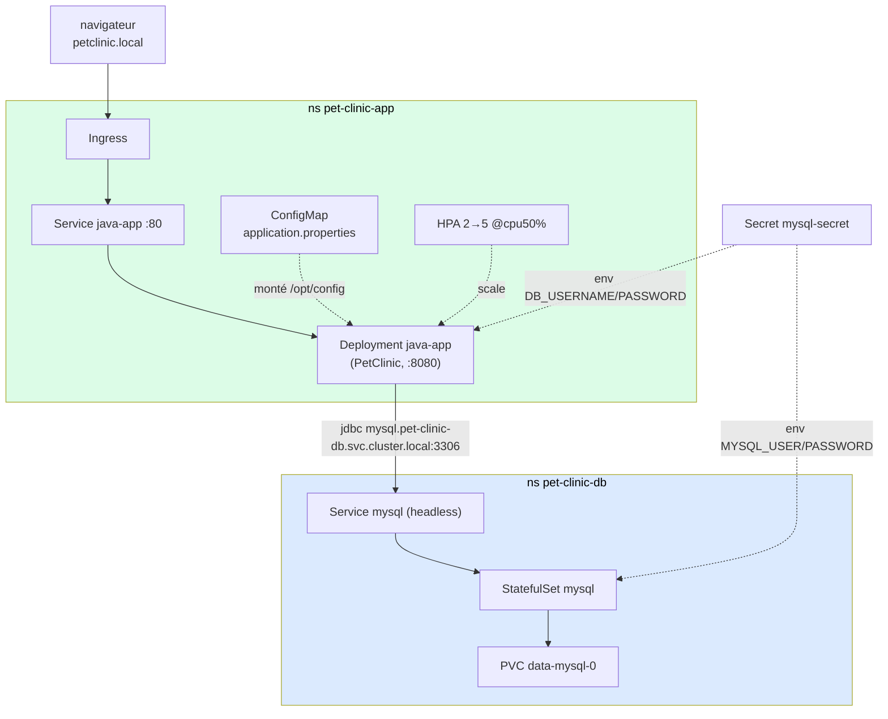

# 07 — Cas global : déployer PetClinic (Java + MySQL) sur Kubernetes

> **Scénario de synthèse à réaliser en autonomie.** Ce cas mobilise **tout** ce que vous avez vu dans la série : namespaces, Deployment, Service, Ingress, ConfigMap, Secret, StatefulSet + PVC, HPA. Les fichiers fournis dans `assets/attachments/k8s/petclinic/` contiennent des `# TODO` à compléter. Un `solution/` complet est là en dernier recours.

On déploie **Spring PetClinic** — une application Java (Spring Boot) adossée à une base **MySQL**. L'app est fournie **déjà buildée** en image Docker (`techiescamp/kube-petclinic-app:3.0.0`) : on se concentre entièrement sur Kubernetes, pas sur le build Java.

> **Prérequis cluster :** minikube démarré, addon **ingress** actif. On activera **metrics-server** à l'étape HPA. Le CNI par défaut suffit.

> **Vous ne connaissez pas Java / Spring ?** Pas d'inquiétude : tout ce qui est spécifique à Spring (la commande de lancement, le point de montage de la config) vous est **donné**. Vous appliquez uniquement des concepts Kubernetes déjà vus.

---

## ✨ Objectifs

- Assembler une application **multi-tiers** (app + base de données) sur Kubernetes
- Isoler app et DB dans **deux namespaces** distincts
- Relier l'app à la DB via le **FQDN DNS** d'un service cross-namespace ([lab 03](3-K8S-COMPLEMENTS-NAMESPACES.md))
- Configurer l'app par **ConfigMap** ([lab 04](4-K8S-CONFIGMAPS.md)) et **Secret** ([lab 05](5-K8S-SECRETS.md))
- Persister la DB avec un **StatefulSet + PVC** ([lab 06](6-K8S-STORAGE.md))
- Exposer par **Ingress** et mettre à l'échelle avec un **HPA** ([lab 01](1-K8S-INTRO.md))

---

## 🗺️ Architecture cible

Avant de créer quoi que ce soit, visualisons **où on va**. L'application se décompose en deux tiers — l'app web (PetClinic) et sa base (MySQL) — répartis dans **deux namespaces séparés**, avec la config et les identifiants injectés depuis l'extérieur du conteneur :



**Deux choix d'architecture à comprendre dès maintenant :**

- **Pourquoi deux namespaces** (`pet-clinic-app` et `pet-clinic-db`) plutôt qu'un seul ? Séparer l'app et la base **isole** deux préoccupations très différentes : on peut appliquer des **NetworkPolicy** distinctes (verrouiller qui accède à la DB — [lab 03](3-K8S-COMPLEMENTS-NAMESPACES.md)), des **quotas** de ressources par tier, des **droits RBAC** différents (l'équipe app n'a pas forcément accès à la DB), et gérer indépendamment le cycle de vie et la conformité (données personnelles côté DB → RGPD). C'est une frontière naturelle en production.

- **Pourquoi le Secret est-il dupliqué** dans les deux namespaces ? Un Secret **ne traverse pas** les namespaces : un pod ne peut lire que les Secrets de **son propre** namespace. Comme MySQL (ns db) et l'app (ns app) ont tous deux besoin des identifiants, le Secret doit exister **de chaque côté** — MySQL pour *créer* l'utilisateur, l'app pour *s'y connecter*.

## 📁 Arborescence cible (vision finale)

Voici **l'ensemble des fichiers** du projet une fois terminé — c'est la **cible**, pas ce qu'on crée d'un coup. **Tous ces fichiers sont fournis dans `assets/attachments/k8s/petclinic/`** ; on les récupérera **un par un au fil des sections suivantes**, en complétant les `# TODO` au passage.

```
petclinic/
├── namespaces.yaml         ← 2 namespaces (fourni)              — section 1
├── secrets.yml             ← Secret MySQL, dans les 2 ns (TODO) — section 2
├── mysql/
│   └── db.yml              ← Service headless + StatefulSet + PVC (fourni) — section 3
└── app/
    ├── app.configmap.yml   ← application.properties, URL JDBC (TODO) — section 4
    ├── app.deploy.yml      ← Deployment (command fournie, branchements TODO) — section 5
    ├── app.svc.yml         ← Service (TODO)   — section 6
    ├── app.ingress.yml     ← Ingress (fourni) — section 6
    └── app.hpa.yml         ← HPA (TODO)       — section 7
```

> Inutile de tout télécharger maintenant. Chaque section vous dit **quel fichier récupérer**, ce qu'il contient, et quoi y compléter.

---

## 🏗️ 1 — Création du projet & namespaces

### Vérifier le cluster

Assurez-vous que minikube tourne et que l'addon ingress est actif :

```bash
minikube status
minikube addons enable ingress    # si pas déjà fait
```

### Créer le dossier de travail

```bash
mkdir -p petclinic/mysql petclinic/app
cd petclinic
```

### Premier fichier : les namespaces

Récupérez [namespaces.yaml](assets/attachments/k8s/petclinic/namespaces.yaml) (fourni, rien à compléter) dans `petclinic/`, puis appliquez-le :

```bash
kubectl apply -f namespaces.yaml
kubectl get ns | grep pet-clinic
# pet-clinic-app    Active
# pet-clinic-db     Active
```

**En conclusion, vous obtenez deux namespaces** — un pour l'app, un pour la base. Comme expliqué dans l'architecture ci-dessus, cette séparation prépare l'isolation réseau/RBAC/quotas et la gestion indépendante des deux tiers (dont la conformité RGPD côté données). Toutes les ressources suivantes iront dans l'un ou l'autre.

---

## 🔑 2 — Le Secret des identifiants MySQL

L'app et MySQL partagent un même couple **utilisateur / mot de passe**. On le stocke dans un **Secret** ([lab 05](5-K8S-SECRETS.md)) — jamais en clair dans les manifests. Rappel de l'archi : ce Secret doit exister **dans les deux namespaces** (un pod ne lit que les Secrets de son namespace).

Récupérez [secrets.yml](assets/attachments/k8s/petclinic/secrets.yml) et complétez les `# TODO` :

```yaml
data:
  username: ____________     # TODO : base64 (ex: echo -n 'petclinic' | base64)
  password: ____________     # TODO : base64
```

> **Rappel base64 ≠ chiffrement** ([lab 05](5-K8S-SECRETS.md)) : `data` attend du base64. Pour éviter l'encodage manuel, utilisez `stringData:` (texte clair, Kubernetes encode). Les deux Secrets (app + db) doivent porter les **mêmes** valeurs.

```bash
kubectl apply -f secrets.yml
# vérifier la présence dans les deux namespaces
kubectl get secret mysql-secret -n pet-clinic-app
kubectl get secret mysql-secret -n pet-clinic-db
```

---

## 🗄️ 3 — MySQL : StatefulSet + PVC

La base de données doit **persister** : on la déploie en **StatefulSet** avec un volume (via `volumeClaimTemplates`), pas en Pod nu.

> **Pourquoi un StatefulSet et pas un Deployment ?** Une base de données a besoin d'une **identité stable** et d'un **volume propre qui la suit**. Le StatefulSet garantit ça : un nom de pod stable (`mysql-0`) et un PVC dédié par réplica. Il exige un **Service headless** (`clusterIP: None`) pour l'adressage. (Le PVC seul, vu au [lab 06](6-K8S-STORAGE.md), suffirait pour une instance unique — le StatefulSet est la forme correcte en production.)

Le fichier [mysql/db.yml](assets/attachments/k8s/petclinic/mysql/db.yml) est **fourni** (Service headless + StatefulSet + PVC + branchement du Secret). Appliquez-le :

```bash
kubectl apply -f mysql/db.yml
kubectl -n pet-clinic-db rollout status statefulset/mysql --timeout=180s
kubectl -n pet-clinic-db get pvc      # data-mysql-0  Bound
```

> Le premier démarrage initialise la base `petclinic` sur un volume vide — laissez-lui le temps (1-2 min).

---

## ⚙️ 4 — ConfigMap de l'app : l'URL de la base

L'app lit sa configuration Spring dans un fichier `application.properties`, qu'on lui fournit via une **ConfigMap montée en volume** ([lab 04](4-K8S-CONFIGMAPS.md)). Le point central : **l'URL JDBC de la base**.

MySQL vit dans le namespace `pet-clinic-db`, l'app dans `pet-clinic-app`. Un nom court comme `mysql` ne suffit donc **pas** — il faut le **FQDN complet** du service, cross-namespace ([lab 03](3-K8S-COMPLEMENTS-NAMESPACES.md)) :

```
<service>.<namespace>.svc.cluster.local
```

Complétez [app/app.configmap.yml](assets/attachments/k8s/petclinic/app/app.configmap.yml) :

```properties
    # TODO : FQDN du service mysql (ns pet-clinic-db), port 3306, base "petclinic"
    spring.datasource.url=jdbc:mysql://____________:____________/____________
    spring.datasource.username=${DB_USERNAME}
    spring.datasource.password=${DB_PASSWORD}
```

> **`${DB_USERNAME}` / `${DB_PASSWORD}`** ne sont pas des placeholders Kubernetes : ce sont des variables que **Spring** substitue au démarrage, à partir des **variables d'environnement** du conteneur — qu'on alimentera depuis le Secret à l'étape suivante.

> ⚠️ **Piège vérifié — l'initialisation du schéma SQL.** Le fichier fourni contient aussi ces trois lignes, **à ne pas retirer** :
> ```properties
> spring.sql.init.mode=always
> spring.sql.init.schema-locations=classpath*:db/mysql/schema.sql
> spring.sql.init.data-locations=classpath*:db/mysql/data.sql
> spring.jpa.hibernate.ddl-auto=none
> ```
> **Pourquoi ?** La commande de lancement utilise `--spring.config.location=/opt/config/application.properties` : elle **remplace intégralement** le `application.properties` embarqué dans l'image. Les propriétés qui disent *où trouver les scripts SQL* (`schema.sql` / `data.sql`, embarqués dans le jar sous `db/mysql/`) sont donc perdues si on ne les redéclare pas — et la base reste **vide**. Symptôme typique : la page d'accueil s'affiche (elle ne touche pas la DB), mais `/vets.html` plante avec `Table 'petclinic.vets' doesn't exist`. `ddl-auto=none` indique à Hibernate de **ne pas** créer le schéma lui-même : ce sont bien les scripts SQL qui font foi.

```bash
kubectl apply -f app/app.configmap.yml
```

---

## 🚀 5 — Deployment de l'app

C'est le cœur de l'assemblage. L'image et la **commande de lancement** sont fournies (spécifiques à Spring Boot — ne les modifiez pas) ; à vous de **brancher le Secret** (env) et **monter la ConfigMap** (volume).

> ⚠️ **Les deux pièges de ce conteneur** (vos notes de départ) :
> - **L'image** : `techiescamp/kube-petclinic-app:3.0.0`.
> - **La commande** : elle indique à Spring où lire la config (le fichier monté par la ConfigMap) et active le profil `mysql`. Elle est fournie telle quelle :
>   ```
>   command: ["java", "-jar", "/app/java.jar",
>             "--spring.config.location=/opt/config/application.properties",
>             "--spring.profiles.active=mysql"]
>   ```
>   Le `mountPath` de la ConfigMap **doit** donc être `/opt/config` — sinon Spring ne trouve pas sa config.

Complétez [app/app.deploy.yml](assets/attachments/k8s/petclinic/app/app.deploy.yml) — les `# TODO` : `secretKeyRef` (name/key) pour `DB_USERNAME`/`DB_PASSWORD`, le `mountPath` de la config, et le nom de la ConfigMap.

```bash
kubectl apply -f app/app.deploy.yml
kubectl -n pet-clinic-app rollout status deploy/java-app --timeout=240s
```

Vérifiez dans les logs que l'app a démarré **et s'est connectée à MySQL** :

```bash
kubectl -n pet-clinic-app logs deploy/java-app | grep -iE "HikariPool.*Added connection|Started PetClinicApplication"
# => HikariPool-1 - Added connection ... mysql.cj.jdbc...
# => Started PetClinicApplication in ... seconds
```

> **Symptôme → Cause → Correctif.**
> - **`CrashLoopBackOff` + erreur de connexion JDBC :** (1) l'URL de la ConfigMap ne pointe pas sur le bon FQDN cross-namespace (section 4) ; (2) le Secret n'est pas branché en env (les `${DB_...}` restent vides) ; (3) MySQL n'est pas encore prêt. Vérifiez dans cet ordre.
> - **L'app démarre (HikariPool OK), mais `/vets.html` renvoie 500 avec `Table 'petclinic.vets' doesn't exist` :** le schéma n'a pas été initialisé — il manque les lignes `spring.sql.init.schema-locations` / `data-locations` / `ddl-auto=none` dans la ConfigMap (voir le piège de la section 4). La connexion marche, mais la base est vide.

---

## 🌐 6 — Service & Ingress

Exposez l'app : d'abord un **Service** (l'app écoute sur `8080`, on l'expose sur `80`), puis un **Ingress** sur `petclinic.local`.

Complétez [app/app.svc.yml](assets/attachments/k8s/petclinic/app/app.svc.yml) (`selector` + `targetPort`), l'[Ingress](assets/attachments/k8s/petclinic/app/app.ingress.yml) est fourni :

```bash
kubectl apply -f app/app.svc.yml
kubectl apply -f app/app.ingress.yml
```

> ⚠️ **Pour accéder à `http://petclinic.local` (macOS / Windows), deux étapes indispensables** (comme au [lab 01](1-K8S-INTRO.md)) :
>
> **1. `minikube tunnel`** — sur macOS/Windows, l'Ingress de minikube n'est **pas** joignable directement. Laissez cette commande tourner dans un terminal dédié (elle demande le mot de passe sudo) :
> ```bash
> minikube tunnel
> ```
>
> **2. Résoudre `petclinic.local` dans le fichier hosts** (`/etc/hosts` sur macOS/Linux, `C:\Windows\System32\drivers\etc\hosts` sur Windows) :
> ```bash
> # avec minikube tunnel actif, le point d'entrée est 127.0.0.1 :
> echo "127.0.0.1  petclinic.local" | sudo tee -a /etc/hosts
> # sans tunnel (Linux, accès direct par l'IP minikube) :
> echo "$(minikube ip)  petclinic.local" | sudo tee -a /etc/hosts
> ```

Ouvrez [http://petclinic.local](http://petclinic.local) → la page **PetClinic** s'affiche. 🎉

```bash
# test en ligne de commande
curl -s http://petclinic.local | grep -o '<title>[^<]*</title>'
# => <title>PetClinic :: a Spring Framework demonstration</title>

# IMPORTANT : tester aussi une page qui LIT la base (la page d'accueil, elle, n'y touche pas)
curl -s -o /dev/null -w "GET /vets.html -> HTTP %{http_code}\n" http://petclinic.local/vets.html
# => HTTP 200   (si 500 : l'init SQL n'a pas tourné — revoir la ConfigMap, section 4)
```

---

## 📈 7 — Autoscaling (HPA)

Enfin, on ajoute un **Horizontal Pod Autoscaler** pour mettre l'app à l'échelle selon la charge CPU ([lab 01](1-K8S-INTRO.md)).

Activez d'abord le **metrics-server** (le HPA en a besoin pour lire les métriques) :

```bash
minikube addons enable metrics-server
```

Complétez [app/app.hpa.yml](assets/attachments/k8s/petclinic/app/app.hpa.yml) (nom du Deployment cible + seuil) et appliquez :

```bash
kubectl apply -f app/app.hpa.yml
kubectl -n pet-clinic-app get hpa java-app-hpa
# NAME           REFERENCE             TARGETS       MINPODS   MAXPODS   REPLICAS
# java-app-hpa   Deployment/java-app   cpu: 18%/50%  2         5         2
```

> Le HPA passe à **2 replicas** (son `minReplicas`) dès qu'il lit les métriques. Le `cpu: <unknown>` initial disparaît une fois metrics-server prêt (~30s). Les `resources.requests.cpu` du Deployment sont **indispensables** — sans eux, pas de pourcentage à calculer.

---

## 🎉 Challenge final

Vous avez un déploiement multi-tiers complet. Vérifiez :

- [ ] `kubectl get all -n pet-clinic-app` et `-n pet-clinic-db` : tout est `Running`
- [ ] PetClinic répond sur `http://petclinic.local`
- [ ] La page **Veterinarians** (`/vets.html`) affiche des données → la base a bien été **initialisée** (schéma + data)
- [ ] Les données MySQL survivent à un `kubectl delete pod mysql-0 -n pet-clinic-db` : le StatefulSet recrée le pod (même nom `mysql-0`) et lui **remonte le même PVC** — comme démontré au [lab 06](6-K8S-STORAGE.md)
- [ ] Le HPA affiche `2/5` replicas et un `%` de CPU
- [ ] Vous savez tracer le chemin d'une requête : Ingress → Service → app → (FQDN) → MySQL

> **Attention au piège du `reclaimPolicy`.** La survie de la donnée à un `delete pod` ne dépend **pas** du `reclaimPolicy` : tant que le **PVC** existe, le volume est conservé et remonté, quel que soit ce réglage. Le `reclaimPolicy` (`Delete` par défaut sur la StorageClass `standard` de minikube, vu au [lab 06](6-K8S-STORAGE.md)) n'entre en jeu **qu'au moment où on supprime le PVC** — il décide alors si le **PV** (le stockage réel) est effacé ou conservé. C'est donc le `kubectl delete namespace` du nettoyage ci-dessous (qui supprime les PVC) qui effacera les données, pas un `delete pod`.

---

## ✅ Bonus

- **Sondes de santé** : ajouter `livenessProbe` / `readinessProbe` sur `/actuator/health` (exposé par l'app).
- **Charge + scaling** : générer du trafic (`hey`, `ab`, ou une boucle `curl`) et observer le HPA monter les replicas.
- **Secret pour root** : `MYSQL_ROOT_PASSWORD` est en clair dans `db.yml` — le passer par le Secret.
- **GitOps** : faire déployer tout ce dossier par ArgoCD ([lab 02](2-K8S-INTRO-ARGO.md)).

---

## 🧹 Nettoyage

```bash
kubectl delete namespace pet-clinic-app pet-clinic-db
# retirez aussi la ligne petclinic.local de /etc/hosts
```

---

## Récap — ce que ce cas a mobilisé

| Brique | Ressource | Lab d'origine |
|---|---|---|
| Isolation | 2 Namespaces | 01 / 03 |
| Config app | ConfigMap montée en volume | 04 |
| Identifiants | Secret (env var) | 05 |
| Base de données | StatefulSet + PVC | 06 |
| Résolution app→DB | FQDN DNS cross-namespace | 03 |
| Exécution app | Deployment | 01 |
| Exposition | Service + Ingress | 01 |
| Mise à l'échelle | HPA + metrics-server | 01 |

➡️ **Précédent : [06 — Volumes & stockage persistant](6-K8S-STORAGE.md)**
